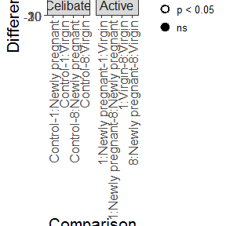

# meantable: Exploring, summarising and visualising data from experiments
Katya Ruggiero  
`r Sys.Date()`  

<style type="text/css">

#TOC {
  position: fixed;
  left: 0;
  top: 0;
  width: 250px;
  height: 100%;
  overflow:auto;
  font-size:14px;
  line-height: 600px;
}
body {
  max-width: 820px;
  margin: auto;
  margin-left:250px;
  line-height: 20px;
  font-size:16px;
}
</style>


Notes to myself: 

* Need to run `devtools::build_vignettes()` 
* Don't need to melt predicted means `ftable`. SO change examples in documentation to `as.data.frame()` and check
* in `confintplot`, add something to change the size of the circle of the mean difference
* in `getLSDsummary()` fix "2\times n columns" in Details of documentation. also consider changing this function's name to `lsdSummary()`

## Introduction

The `meantable` package is designed for applied statisticians and researchers who use R to analyse data from designed experiments. It comprises a suite of functions which facilitate data exploration, summarisation and visualisation. Specifically, it significantly reduces the subtantial coding effort and editing time required by researchers when producing publication-quality tabular and graphical summaries of post-hoc test results for inclusion in their manuscripts.

The `meantable` package comprises a suite of functions which simplify the exploration, summarisation and visualisation of data from designed experiments in R. Some of the summarisation functions are oriented towards producing summary tables of post-hoc test results which may be quickly formatted for insertion into publications.  Similarly, the visualisation functions are oriented towards producing publication quality graphical summaries of the post-hoc tests.

A key post-hoc test summarisation function in the `meantable` package is `makeSummaryTable()`. It was developed to complement the post-hoc tests performed by the `predictmeans()` function from the  [predictmeans](https://cran.r-project.org/package=predictmeans) package, turning the list of objects that this function generates to a dataframe in which each row contains 

An important objective of the task of analysing data from experiments is the tabular and visual summarisation of results from the models they fit to their data. In particular, the results of pair wise comparisons of means, often called post-hoc tests. 

Designed to minimise much of the coding labour, repetitive tasks, needed to do this. 

And to make it more intuitive for and minimise casual R users such as biologists/experimental researchers 

The data visualisation functions in `meantable` are wrappers to Hadley Wickham's  [ggplot2](https://cran.r-project.org/web/packages/ggplot2/index.html) data visualisation package, enabling production of elegant publication-quality graphs while eliminating the significant amount of coding that ordinarily would be required due to the grammar of graphics tool on which [ggplot2](https://cran.r-project.org/web/packages/ggplot2/index.html) is based. This benefits those who do not wish to invest time in the initially steep learning curve required to master  [ggplot2](https://cran.r-project.org/web/packages/ggplot2/index.html), but does not disadvantage those who wish to have greater control over the graphs produced by these wrappers because the grammar of graphics tool on which ggplot2 is based allows the user to add, remove or alter components in a plot. [Why I don't use ggplot2](https://simplystatistics.org/2016/02/11/why-i-dont-use-ggplot2/) by Jeff Leak "require a significant amount of coding" of [Simply Statistics](https://simplystatistics.org/)

## Who may find this package useful?

Are you analysing data from experiments? Are you fitting:

1. a *linear* model to your data using either `anova()` or `lm()`, contained in base R, or 
2. a linear *mixed* model using:
    + `lme()`, from the [nlme](https://cran.r-project.org/package=nlme) package, or `lmer`, from the [lme4](https://cran.r-project.org/package=lme4) package, or  
    + `asreml()`, from the `ASReml-R` package (the engine for using the numerical routines from the ASReml$^\textsf{TM}$ program (Gilmour *et al.*, 2002) in R.
    
If so, keep reading. After fitting your model, are your goals to generate:

1. tables of predicted means?
2. summary tables of post-hoc tests comparing predicted means between pairs of treatment groups?
3. plots which clearly display post-hoc test results?

If you answered `YES` to all of the above **and** you are using either `predictmeans()`, from the [predictmeans](https://cran.r-project.org/package=predictmeans) package , or ` predictparallel.asreml()`, from the [asremlPlus](https://cran.r-project.org/package=asremlPlus) package, to perform post-hoc tests, then you will find that the `meantable` package useful. If you are not currently using `predictmeans()` or ` predictparallel.asreml()`, but 1--3 are your goals, you may still want to continue reading.

Performing post-hoc tests for pairwise comparisons of means and presenting summaries of the results in a clear and meaningful way are important objectives in the analysis of data from (designed) experiments. Until the introduction of the `predictmeans` package, post-hoc tests were one of the things that R did least well. This is because the default parameterisation used by the linear model fitting functions in R is the *first-level zero constraint*, also known as the *reference cell model* among some R users. The parameter estimates under this constraint are not, in general, the pairwise comparisons of means that are of primary interest. Extracting the pairwise comparisons of interest is relatively straightforward, albeit tedious, for simple experiments with, say, a single treatment factor. However, for more complex experiments with multiple treatment factors and which additionally involve blocking, this process is more involved. 

Enter the `predictmeans` function: it conducts the post-hoc tests for all pairwise comparisons of means for any fitted term in a linear (mixed) model, and more (see the `predictmeans` documentation for more information). The one drawback of `predictmeans` is that the results, stored in a <tt>list</tt>, are spread across three objects: the means are stored in an <tt>ftable</tt>, the pairwise differences between means an corresponding least significant differences in a <tt>matrix</tt> and $t$-statistics and \eqn{p}-values in another <tt>matrix</tt>. `meantable` contains a suite of wrapper functions which extract information from across these three objects and assembles them in a single summary table of post-hoc test results. 

But wait, there's more! Not all pairwise comparisons are of interest, so  `meantable` contains functions which enable the user to easily extract only those comparisons which are of interest. `meantable` also contains functions which generate plots of predicted means with least significant difference (LSD) bars which are specific to the pairwise comparisons of interest or, if the user prefers, pairwise differences between means with $100 \times (1-\alpha)\%$ confidence interval error bars. `meantable` also contains a few other wrapper functions which simplify the task of exploring data from multi-factor experiments. 

What now follows is a guided tour of the functions contained in `meantable`, with examples showing their use.

We now demonstrate the workflow of using the `meantable` functions through the analysis of two datasets, `fruitfly` and `bugs`, both available in the package.

## Fruitflies and bugs

We introduce two real datasets, namely fruitfly `fruitfly` and `bugs`, to demonstrate the utility of `meantable`'s functions. These functions are available in the package.


###  Longevity of the male fruitfly
<a name="fruitfly-data"></a>

*Does increased sexual activity affect longevity of male fruitflies?* In an attempt to answer this question, Partridge & Farquhar (1981) conducted an experiment in which sexual activity was manipulated by supplying individual male fruitflies with either one (<tt>Partners = 1</tt>) or eight (<tt>Partners = 8</tt>) receptive virgin females (<tt>Type = 1</tt>) per day. The longevity of these males was compared with that of two control types. The first control consisted of individual males kept with either one or eight newly inseminated (pregnant) nonreceptive females (<tt>Type = 0</tt>). The other control was individual males kept with no females (<tt>Partners = 0</tt>; <tt>Type = 9</tt>). Twenty-five male fruitflies were randomly assigned to each of these four groups. The observations on each fly were `Longevity`, `Thorax` length, and the percentage of each day spent `Sleep`ing. The first few rows of the `fruitfly` dataframe are shown in 


```r
data(fruitfly)
```


 ID   Partners   Type   Longevity   Thorax   Sleep
---  ---------  -----  ----------  -------  ------
  1          8      0          35     0.64      22
  2          8      0          37     0.68       9
  3          8      0          49     0.68      49
  4          8      0          46     0.72       1
  5          8      0          63     0.72      23
  6          8      0          39     0.76      83

### Bug growth in biofluid
<a name="bugs-data"></a>

The goal of this study was to assess the growth of five bacterial strains (E. coli, E. faecalis, K. pneumoniae, P. aeruginosa and S. aureus) over time (4 and 24 hours post-inoculation) in mesenteric lymph harvested from normal (Control) and diseased (DM, HS and AP) rats. Growth of these bacterial strains was investigated under two settings, namely at Low and High initial (baseline) inoculation concentrations. The `bugs` data available in the `meantable` package includes only the data collected from the low baseline concentration setting.

Describe contents of `bugs`


```r
data(bugs)
```

      Rat  State   Bacteria   Time    Baseline   Cells
---  ----  ------  ---------  -----  ---------  ------
11      7  AP      E. coli    4          16667    8000
12     14  AP      E. coli    24         16667    4533
13      7  AP      E. coli    24         16667       0
14     13  AP      E. coli    24         23333    2133
15     19  AP      E. coli    24         21333    2067
16     13  AP      E. coli    4          23333   16000

[Perhaps use these sentences in the actual analysis/demonstrations below:] Since fair comparisons between disease models, both within and across time, depend on homogeneous baseline concentrations of each strain, baseline concentrations are first explored and analysed and then followed by a discussion of the results from the analyses of the baseline-adjusted data.


## The lifespan of male fruitflies

A common feature of datasets from designed experiments is that often most, if not all, of the indepedent variables have  categorical values. Frequently the categories are coded as integers. So, if the data are read into R without any other "intervention" such variables will be designated as being of type <tt>integer</tt>. This is the case for the variables fruitfly `ID` (1 -- 25), number of `Partners` (0, 1 and 8) and `Type` of partner (0 = newly pregnant female, 1 = virgin female and 9 = not applicable) in the [fruitfly](#fruitfly-data) data (check using `str(fruiftly)`). Thus, before we can begin to explore any connection between these variables and the longevity of male fruitflies in any meaningful way, we must first convert them to type <tt>factor</tt>. We can perform this type conversion of all three variables simultaneously using `meantable`'s \code{toFactor()} function, i.e.


```r
newfruitfly <- toFactor(fruitfly, variables = c("ID", "Partners", "Type"))
```

The [fruitfly](#fruitfly-data) data contains three measured variables, namely `Longevity` (lifespan, in days), `Thorax` (length of thorax, in mm) and `Sleep` (percentage of each day spent sleeping). Here we will only explore the nature of the association between between thorax length and longevity for each combination of number of `Partner`s and partner `Type`. Although the values of `Partner` are numeric, only three values -- 0, 1 and 8 -- are considered in the experiment. So it is not unreasonable that we treat this variable as a factor with three levels, which is what we do in our treatment of this dataset and, indeed, how Partridge and Farquhar (1981) treated this variable.


```r
#replications(Thorax~Partners*Type, data=newfruitfly)
```

### Exploring longevity by partner type and number

Boxplots provide an informative visualisation tool for exploring the distribution of a dataset, here `Longevity` of male fruitflies, by treatment groups, here `Partners` and `Type`. The wrapper function `ggBoxplot` makes this easy, i.e.


```r
ggBoxplot(newfruitfly, y = "Longevity", x = "Partners", facets = c("Type", "."))
```


```r
#groupSummaries(splitBlockData, y="logAUC", factors=c("Disease", "Organ"), FUN=meanse)
```

Of course, the boxplot would be easier to interpret if the integer codes used for partner `Type` were relabelled with meaningful character strings and if the axis labels were a little more informative. The x- and y-axis labels are controlled via the `xLabel` and `yLabel` arguments, respectively, e.g.


```r
ggBoxplot(newfruitfly, y = "Longevity", x = "Partners", facets = c("Type", "."),
         xLabel = "Number of partners", yLabel = "Lifespan (days)")
```


So what do the boxplots show? Bottom line: having a harem of virgin female fruitflies may not be an optimal strategy for a male fruitfly who wants to maximise his lifespan! 

Summary statistics by `Type` and number of `Partners` are can be calculated using the  `groupSummaries()` function which is a wrapper for `tapply()`, thereby enabling anonymous functions to be passed to it. For example, we might be interested in the actual medians and iterquartile ranges for the above boxplots, i.e.


```r
groupSummaries(newfruitfly, y="Longevity", factors=c("Type", "Partners"), 
               FUN=function(x) c(Median=median(x), IQR=IQR(x)))
```

```
##             Type Partners Median IQR
## 1        Control        0     62  28
## 2 Newly pregnant        1     65  22
## 3 Newly pregnant        8     65  21
## 4         Virgin        1     56  20
## 5         Virgin        8     40  15
```

Or, we might be interested in the means, their standard erors and, perhaps, also the variances of each group, i.e.


```r
groupSummaries(newfruitfly, y="Longevity", factors=c("Type", "Partners"), 
               FUN=function(x) c(meanse(x), Var=var(x)))
```

```
##             Type Partners  Mean       SE      Var
## 1        Control        0 63.56 16.45215 270.6733
## 2 Newly pregnant        1 64.80 15.65248 245.0000
## 3 Newly pregnant        8 63.36 14.53983 211.4067
## 4         Virgin        1 56.76 14.92838 222.8567
## 5         Virgin        8 38.72 12.10207 146.4600
```

The IQRs and variances in the above group summaries show that the variation in longevity among `Control` male fruitflies is almost twice that among male fruitflies living with 8 virgin females! Is this starting to make a convincing case against living a harem of virgins?

Note that the `meanse()` function passed to the `FUN` argument is a `meantable` function. 

The advantage of using `groupSummaries()` over `tapply()` is that the former returns the results as a dataframe (rather than the multi-dimensional array returned by `tapply()`), making the results ready to be passed on to any of the base R or `ggplot2` plotting functions.

<!--
KR change this and reference [boxplot.stats()](https://stat.ethz.ch/R-manual/R-devel/library/grDevices/html/boxplot.stats.html): The two ‘hinges’ are versions of the first and third quartile, i.e., close to quantile(x, c(1,3)/4). The hinges equal the quartiles for odd n (where n <- length(x)) and differ for even n. Whereas the quartiles only equal observations for n %% 4 == 1 (n = 1 mod 4), the hinges do so additionally for n %% 4 == 2 (n = 2 mod 4), and are in the middle of two observations otherwise. -->


### Linear model for factorial plus added control

The fruitfly experiment is a $2 \times 2$ factorial experiment with an added control. The control represents a "zero" level for both the `Type` and `Partners` factors, and the factorial structure of Type $\times$ Partners operates only when a male fruitfly is supplied with at least one female fruitfly (virgin or newly pregnant). The following table shows combinations of `Partners` and `Type` that are feasible. It also shows that an additional `Control` factor, populated with value (level) <tt>No</tt> when a female is supplied and <tt>Yes</tt> otherwise.

<table>
<thead>
<tr>
<th style="border-bottom:hidden"></th>
<th style="text-align:center; border-bottom:hidden; padding-bottom:0; padding-left:3px;padding-right:3px;" colspan="3"><div style="border-bottom: 1px solid #ddd; padding-bottom: 5px;">Partners</div></th>
</tr>
<tr>
<th style="text-align:left;">   </th>
   <th style="text-align:right;"> 0 </th>
   <th style="text-align:right;"> 1 </th>
   <th style="text-align:right;"> 8 </th>
  </tr>
</thead>
<tbody>
<tr>
<td style="text-align:left;"> Control </td>
   <td style="text-align:right;"> 25 </td>
   <td style="text-align:right;"> 0 </td>
   <td style="text-align:right;"> 0 </td>
  </tr>
<tr>
<td style="text-align:left;"> Newly pregnant </td>
   <td style="text-align:right;"> 0 </td>
   <td style="text-align:right;"> 25 </td>
   <td style="text-align:right;"> 25 </td>
  </tr>
<tr>
<td style="text-align:left;"> Virgin </td>
   <td style="text-align:right;"> 0 </td>
   <td style="text-align:right;"> 25 </td>
   <td style="text-align:right;"> 25 </td>
  </tr>
</tbody>
</table>

The fixed effects model for this factorial plus added control requires both crossing and nesting, i.e. 


```r
# create Control factor
newfruitfly$Control <- factor(ifelse(newfruitfly$Type=="Control", "Yes", "No"))
fruitfly.lm <- lm(Longevity ~ Control/(Partners*Type), data=newfruitfly)
```

The resulting ANOVA is shown below.

<table>
 <thead>
  <tr>
   <th style="text-align:left;">   </th>
   <th style="text-align:right;"> Df </th>
   <th style="text-align:right;"> Sum Sq </th>
   <th style="text-align:right;"> Mean Sq </th>
   <th style="text-align:right;"> F value </th>
   <th style="text-align:right;"> Pr(&gt;F) </th>
  </tr>
 </thead>
<tbody>
  <tr>
   <td style="text-align:left;"> Control </td>
   <td style="text-align:right;"> 1 </td>
   <td style="text-align:right;"> 1170.45 </td>
   <td style="text-align:right;"> 1170.4500 </td>
   <td style="text-align:right;"> 5.337712 </td>
   <td style="text-align:right;"> 0.0225769 </td>
  </tr>
  <tr>
   <td style="text-align:left;"> Control:Partners </td>
   <td style="text-align:right;"> 1 </td>
   <td style="text-align:right;"> 2371.69 </td>
   <td style="text-align:right;"> 2371.6900 </td>
   <td style="text-align:right;"> 10.815839 </td>
   <td style="text-align:right;"> 0.0013209 </td>
  </tr>
  <tr>
   <td style="text-align:left;"> Control:Type </td>
   <td style="text-align:right;"> 1 </td>
   <td style="text-align:right;"> 6674.89 </td>
   <td style="text-align:right;"> 6674.8900 </td>
   <td style="text-align:right;"> 30.440124 </td>
   <td style="text-align:right;"> 0.0000002 </td>
  </tr>
  <tr>
   <td style="text-align:left;"> Control:Partners:Type </td>
   <td style="text-align:right;"> 1 </td>
   <td style="text-align:right;"> 1722.25 </td>
   <td style="text-align:right;"> 1722.2500 </td>
   <td style="text-align:right;"> 7.854137 </td>
   <td style="text-align:right;"> 0.0059140 </td>
  </tr>
  <tr>
   <td style="text-align:left;"> Residuals </td>
   <td style="text-align:right;"> 120 </td>
   <td style="text-align:right;"> 26313.52 </td>
   <td style="text-align:right;"> 219.2793 </td>
   <td style="text-align:right;"> NA </td>
   <td style="text-align:right;"> NA </td>
  </tr>
</tbody>
</table>

The following table summarises the interpretations of each of the terms in the above ANOVA table. From this we see that the presence of female fruitflies is significant (p = 0.023) and, when females are supplied, there is an interaction between the number and type of partner.

| Term                  | Interpretation                                                 |
|:--------------------- |:-------------------------------------------------------------- |
| Control               | overall effect of the presence of female fruitflies            |
| Control:Partners      | comparison between 1 and 8 female partners (averaged over the  |
|                       | different virgin and newly pregnant partners)                  |
| Control:Type          | comparison between virgin and newly pregnant female partners   |
|                       | (averaged over the number of partners)                         |
| Control:Partners:Type | the interaction between Partners and Type (given that a female |
|                       | has been supplied)                                             |


### Predicted Longevity

We can now use the `predictmeans()` function from the [predictmeans](https://cran.r-project.org/package=predictmeans) package to calculate the predicted means, and their standard errors, for each factorial treatment combination corresponding to the model term <tt>Control:Partners:Type</tt>. 


```r
fruitfly.pm <- predictmeans(fruitfly.lm, modelterm = "Control:Partners:Type", 
                            pairwise = TRUE, plot = FALSE)
```

Additionally, the `predictmeans()` function, with argument `pairwise = TRUE` (default `FALSE`), returns the results of the post-hoc tests to a <tt>list</tt> comprising objects of different types, as shown in the following table.

<a name="pmListContents-table"></a>

Object                          Class   
------------------------------  --------
Predicted Means                 ftable  
Standard Error of Means         numeric 
Standard Error of Differences   numeric 
LSD                             numeric 
Pairwise LSDs                   matrix  
Pairwise p-value                matrix  

For presentation purposes, such as for a peer-reviewed journal article, we may wish to extract the predicted means


```r
fruitfly.pm$`Predicted Means`
```

```
##          Control      No                           Yes                      
##          Type    Control Newly pregnant Virgin Control Newly pregnant Virgin
## Partners                                                                    
## 0                     NA             NA     NA   63.56             NA     NA
## 1                     NA          64.80  56.76      NA             NA     NA
## 8                     NA          63.36  38.72      NA             NA     NA
```

and their standard errors


```r
fruitfly.pm$`Standard Error of Means`
```

```
## All means have the same Stder 
##                       2.96162
```

and aggregate them in a single table. We can do this in the first instance by using `meantable`'s `means2df()` function, i.e.


```r
fruitfly.mse <- means2df(fruitfly.pm, digits = 2)
```

The contents of the `fruitfly.mse` dataframe are shown in the following table and we will be needed later to generate visual summaries of the post-hoc test results stored in `fruitfly.pm`.


 Partners    Control         Type          Mean   s.e.
----------  ---------  ----------------  ------  -----
    0          Yes         Control        63.56   2.96
    1          No       Newly pregnant    64.80   2.96
    8          No       Newly pregnant    63.36   2.96
    1          No           Virgin        56.76   2.96
    8          No           Virgin        38.72   2.96

Notice that the standard errors of the means (`s.e.`) are the same for all five treatment combinations because each is equally replicated. Due to the redundancy in this case, we may wish to exclude the `s.e.` from this dataframe. We can do this simply by setting the `se` argument to `FALSE`. 

<a name="block-inflated-sem"></a>While standard errors of predicted means may be interesting for completely randomised design, this is generally not true for experiments involving blocking factors and in which the block random effects are non-neglible. In these cases the estimated standard errors are inflated by the between block variation. A more appropriate statistic to use is the effective standard error (see GenStat manual - reference). This has not been implemented in the current version of `meantable`.

### Summarising post-hoc test results

From our analyses so far (i.e. boxplots, ANOVA and predicted means), it appears that the optimal strategy for a male fruitfly wishing to maximimise his longevity is a life of celibacy! Is this true? Is there a statistically significant difference in mean longevity between male fruitflies supplied with a single newly pregnant female and those supplied with a single virgin female? If so, what is the magnitude and direction of this difference? What do the post-hoc test results say? 

The information we require to answer these questions is contained across two matrices generated by `predictmeans()`, namely the `Pairwise LSDs` matrix, where all pairwise differences between means are recorded above the diagonal and their corresponding LSDs and recorded below:


```r
fruitfly.pm[5]
```

```
## $`Pairwise LSDs`
##                     Yes:0:Control No:1:Newly pregnant No:8:Newly pregnant No:1:Virgin No:8:Virgin
## Yes:0:Control             0.00000            -1.24000             0.20000     6.80000       24.84
## No:1:Newly pregnant       8.29266             0.00000             1.44000     8.04000       26.08
## No:8:Newly pregnant       8.29266             8.29266             0.00000     6.60000       24.64
## No:1:Virgin               8.29266             8.29266             8.29266     0.00000       18.04
## No:8:Virgin               8.29266             8.29266             8.29266     8.29266        0.00
## attr(,"Significant level")
## [1] 0.05
## attr(,"Degree of freedom")
## [1] 120
## attr(,"Note")
## [1] "LSDs matrix has mean differences (row-col) above the diagonal, LSDs (adjusted by 'none' method) below the diagonal"
```

and the `Pairwise p-value` matrix, which contains the corresponding $t$-statistics (above diagonal)  and p-values (below diagonal):


```r
fruitfly.pm[6]
```

```
## $`Pairwise p-value`
##                     Yes:0:Control No:1:Newly pregnant No:8:Newly pregnant No:1:Virgin No:8:Virgin
## Yes:0:Control              0.0000             -0.2961              0.0478      1.6235      5.9307
## No:1:Newly pregnant        0.7677              0.0000              0.3438      1.9196      6.2268
## No:8:Newly pregnant        0.9620              0.7316              0.0000      1.5758      5.8830
## No:1:Virgin                0.1071              0.0573              0.1177      0.0000      4.3072
## No:8:Virgin                0.0000              0.0000              0.0000      0.0000      0.0000
## attr(,"Degree of freedom")
## [1] 120
## attr(,"Note")
## [1] "The matrix has t-value above the diagonal, p-value (adjusted by 'none' method) below the diagonal"
## attr(,"Letter-based representation of pairwise comparisons at significant level '0.05'")
##                     Group
## Yes:0:Control          A 
## No:1:Newly pregnant    A 
## No:8:Newly pregnant    A 
## No:1:Virgin            A 
## No:8:Virgin             B
```

The `makeSummaryTable()` function collates this information, storing it in a dataframe, i.e. 


```r
fruitfly.tab <- makeSummaryTable(fruitfly.pm)
```

The following table shows the contents of this dataframe. Each row is a summary of the post-hoc test results associated with a given pairwise comparison of means. The first entry of each row (`Comparison`) is a character string containing the names of the two treatment groups whose means are contrasted, separated by a minus sign. For example, the `Comparison` name in the first row of the table is `Yes:0:Control-No:1:Newly pregnant`, meaning the predicted mean`Longevity` of male fruitflies supplied with a newly pregnant female is substracted from that of males who were not supplied with any females. Since the `Difference` between these predicted means is -1.24, this tells us that male fruitflies in this study who were supplied with a newly pregnant female lived, on average, about a day longer than celebate males. Of course, this difference is not statistically significant ($p$=0.7677).  


Comparison                                 Difference     SED     LSD      lwr      upr        t        p
----------------------------------------  -----------  ------  ------  -------  -------  -------  -------
Yes:0:Control-No:1:Newly pregnant               -1.24   4.188   8.293   -9.533    7.053   -0.296   0.7677
Yes:0:Control-No:8:Newly pregnant                0.20   4.188   8.293   -8.093    8.493    0.048   0.9620
Yes:0:Control-No:1:Virgin                        6.80   4.188   8.293   -1.493   15.093    1.624   0.1071
Yes:0:Control-No:8:Virgin                       24.84   4.188   8.293   16.547   33.133    5.931   0.0000
No:1:Newly pregnant-No:8:Newly pregnant          1.44   4.188   8.293   -6.853    9.733    0.344   0.7316
No:1:Newly pregnant-No:1:Virgin                  8.04   4.188   8.293   -0.253   16.333    1.920   0.0573
No:1:Newly pregnant-No:8:Virgin                 26.08   4.188   8.293   17.787   34.373    6.227   0.0000
No:8:Newly pregnant-No:1:Virgin                  6.60   4.188   8.293   -1.693   14.893    1.576   0.1177
No:8:Newly pregnant-No:8:Virgin                 24.64   4.188   8.293   16.347   32.933    5.883   0.0000
No:1:Virgin-No:8:Virgin                         18.04   4.188   8.293    9.747   26.333    4.307   0.0000

In addition to extracting and collating the information available from the list of objects generated by `predictmeans()`, the `makeSummaryTable()` also computes, for each pairwise difference between means, the standard error of the difference (`SED`) and the lower (`lwr`) and upper (`upr`) confidence limits of each difference. Note that the level of significance used to determine the LSD and, therefore, confidence limits in the summary table above is set within the `predictmeans()` functions by supplied a value to its `level` argument. Here we have used the default `level = 0.05`.

<br>

__*Not all comparisons are "interesting"*__

<br>

Not all of the pairwise comparisons in the above summary table are of biological interest. For instance, the comparison of longevity between male fruitflies supplied with 1 *newly pregnant* female and those supplied with 8 *virgin* females is statistically significant (p < 0.0001). But, what is the cause of this difference in longevity? Is it the number of females, or their pregnancy status, or both? In this case, we might not be interested in this contrast. More generally, we may only be interested in presenting results from those pairwise comparisons between treatment groups that differ in the levels of one and the same factor across the pair of treatments. 

The fruitfly experiment is an unusual case due to the "plus control" factor. So, we are interested in keeping all pairwise comparisons between the control group and the four factorial treatment combinations of `Partners` and `Types`. However, among the pairwise comparisons between the four factorial treatment combinations of `Partners` and `Type` we are only interested in retaining comparisons between groups that differ by in only the levels of one factor. We can do this by applying the `getFixedLevelLevelComparisons()` function to the `Comparison` names in the last six rows of the table, i.e.


```r
# select comparisons that do not include the control treatment
noControlComparisons <- fruitfly.tab$Comparison[5:10]

# find and keep only those rows with "interesting" comparisons
keepRows <- getFixedLevelComparisons(noControlComparisons, sepChar = ":")
fruitfly.tab2 <- rbind(fruitfly.tab[1:4, ], fruitfly.tab[5:10,][keepRows,])
fruitflyCompNames <- fruitfly.tab2$Comparison

# simplify comparison names
fruitfly.tab2$Comparison <- gsub("(Yes:0:)|No:", "", fruitfly.tab2$Comparison)
```


Comparison                           Difference     SED     LSD      lwr      upr        t        p
----------------------------------  -----------  ------  ------  -------  -------  -------  -------
Control-1:Newly pregnant                  -1.24   4.188   8.293   -9.533    7.053   -0.296   0.7677
Control-8:Newly pregnant                   0.20   4.188   8.293   -8.093    8.493    0.048   0.9620
Control-1:Virgin                           6.80   4.188   8.293   -1.493   15.093    1.624   0.1071
Control-8:Virgin                          24.84   4.188   8.293   16.547   33.133    5.931   0.0000
1:Newly pregnant-8:Newly pregnant          1.44   4.188   8.293   -6.853    9.733    0.344   0.7316
1:Virgin-8:Virgin                         18.04   4.188   8.293    9.747   26.333    4.307   0.0000
1:Newly pregnant-1:Virgin                  8.04   4.188   8.293   -0.253   16.333    1.920   0.0573
8:Newly pregnant-8:Virgin                 24.64   4.188   8.293   16.347   32.933    5.883   0.0000

The post-hoc tests summary table tells us that the average lifespan of male fruitflies supplied with 8 virgin females is significantly reduced, by an average of almost 25 days, compared with celibate males. While celibacy appears to extend life significantly, it seems that a monogamous lifestyle, living with a single virgin female, may provide a compromise since the mean decrease in lifespan is about 7 days (compared with celibacy)! Life's about compromises!

### Visual summaries of post-hoc test results

One way we may visually summarise the results in the above summary table is by plotting each `Difference` with its corresponding 95% `lwr` and `upr` confidence limits, i.e.


```r
confintplot(fruitfly.tab2, y="Difference", x = "Comparison",
            axisLabelSize = 16, tickMarkLabelSize = 12, xTickLabelAngle = 90)
```


We may suppress the drawing of the dashed horizontal line by setting the value of the 
`zeroline` argument to `FALSE`. 

We may prefer to have a plot which clearly separates contrasts involving the `Control` group of celebate male fruitflies, and those supplied with `Newly pregrant` or `Virgin` females. Earlier we stored the reduced set of comparison names in the character vector `fruitflyCompNames`, i.e.


```r
fruitflyCompNames
```

```
## [1] Yes:0:Control-No:1:Newly pregnant       Yes:0:Control-No:8:Newly pregnant      
## [3] Yes:0:Control-No:1:Virgin               Yes:0:Control-No:8:Virgin              
## [5] No:1:Newly pregnant-No:8:Newly pregnant No:1:Virgin-No:8:Virgin                
## [7] No:1:Newly pregnant-No:1:Virgin         No:8:Newly pregnant-No:8:Virgin        
## 10 Levels: No:1:Newly pregnant-No:1:Virgin ... Yes:0:Control-No:8:Virgin
```

While these <tt>Comparison</tt> names written in the form 

<center><tt>treatment1 -- treatment2</tt></center>

makes clear the order of the differencing between means of the two treatment groups that are being compared, this format is generally not amenable to sorting (by treatment group, for example), subsetting or controlling plotting behaviour. `meantable`'s `comparisonNames2df()` function enables us to disaggregate each comparison name into its original factor-level names, creating a separate column for each original factor. Each column is given the corresponding factor's name with either a <tt>1</tt> or <tt>2</tt> concatenated at the end depending on whether the factor-level contributed to <tt>Treatment1</tt> or <tt>Treatment2</tt>, i.e. 


```r
disaggNames.df <- comparisonNames2df(fruitflyCompNames, split.at = ":",
                                     varNames = c("Control", "Partners", "Type"))
```


Control1   Partners1   Type1            Control2   Partners2   Type2          
---------  ----------  ---------------  ---------  ----------  ---------------
Yes        0           Control          No         1           Newly pregnant 
Yes        0           Control          No         8           Newly pregnant 
Yes        0           Control          No         1           Virgin         
Yes        0           Control          No         8           Virgin         
No         1           Newly pregnant   No         8           Newly pregnant 
No         1           Virgin           No         8           Virgin         
No         1           Newly pregnant   No         1           Virgin         
No         8           Newly pregnant   No         8           Virgin         

We insert a copy of the `Control1` factor (first column in the above table) into the `fruitfly.tab2` dataframe, so that we may use it as a facet variable in our plot. Before generating the plot, however, we will relabel the `Yes` and `No` values of `Control1` with `Celebate` and `Active` respectively.


```r
fruitfly.tab2 <- data.frame(Control=disaggNames.df[,1], fruitfly.tab2)
fruitfly.tab2 <- transform(fruitfly.tab2, 
                 Control = factor(Control, levels=c("Yes", "No"), labels=c("Celibate", "Active")))
```

Control    Comparison                           Difference     SED     LSD      lwr      upr        t        p
---------  ----------------------------------  -----------  ------  ------  -------  -------  -------  -------
Celibate   Control-1:Newly pregnant                  -1.24   4.188   8.293   -9.533    7.053   -0.296   0.7677
Celibate   Control-8:Newly pregnant                   0.20   4.188   8.293   -8.093    8.493    0.048   0.9620
Celibate   Control-1:Virgin                           6.80   4.188   8.293   -1.493   15.093    1.624   0.1071
Celibate   Control-8:Virgin                          24.84   4.188   8.293   16.547   33.133    5.931   0.0000
Active     1:Newly pregnant-8:Newly pregnant          1.44   4.188   8.293   -6.853    9.733    0.344   0.7316
Active     1:Virgin-8:Virgin                         18.04   4.188   8.293    9.747   26.333    4.307   0.0000
Active     1:Newly pregnant-1:Virgin                  8.04   4.188   8.293   -0.253   16.333    1.920   0.0573
Active     8:Newly pregnant-8:Virgin                 24.64   4.188   8.293   16.347   32.933    5.883   0.0000

We can now use the `Control` factor to lay out the plot in two-column grid according to celibate and active male fruitflies, i.e.


```r
fruitfly.tab2$Comparison <- factor(fruitfly.tab2$Comparison)
confintplot(fruitfly.tab2, y="Difference", x = "Comparison", facets = c("Control", "."),
            axisLabelSize = 16, tickMarkLabelSize = 12, xTickLabelAngle = 90)
```


<br>

As we would expect, the results in the above confidence interval plot agree with those in the previous table; confidence intervals which do not cross <tt>Difference = 0</tt> dashed line indicate a significant difference between the means at 0.05 level. Specifically, we see that longevity is significantly higher for male fruitflies who are celibate, supplied with 1 virgin female or 8 newly pregnant females than it is for those supplied with a harem of 8 virgin females. The nice thing about this plot is that we can also so when there is a tendency for increased longevity, even if not statistically significant. For example, we are 95% confident that the mean lifespan of male fruitflies supplied with a newly pregnant female is -0.25 to 16.3 days longer those supplied with a virgin female.

Finally, we may choose to distinguish between those pairwise differences between means that have a $p$-value less than a nominal level of significance, `alpha`, and those which do not. We do this by providing additional arguments to `confintplot`, namely we set `showSignif = TRUE` (to use different plotting characters for `Difference`s which are statistically significant), `pvalVar = "p"` (to nominate the column in the dataframe containing the $p$-values) and `alpha = 0.05`, i.e.


```r
confintplot(fruitfly.tab2, y="Difference", x = "Comparison", facets = c("Control", "."),
            showSignif=TRUE, pvalVar="p", alpha = 0.05,
            axisLabelSize = 16, tickMarkLabelSize = 12, xTickLabelAngle = 90)
```


<br>

__*Plots with Least Significant Difference error bars*__

<br>

Some researchers prefer to plot means with standard error bars as visual summaries for post-hoc tests. It is not uncommon among experimental biologists, for example, to use bar plots with the tops of the bars representing the raw means and with error bars drawn emerging from the top (and sometimes also the bottom) of each bar, e.g. 

[Put image from journal article]

It is almost ubiquitous for such error bars to be the length of a single standard error of the mean (SEM), each calculated directly from the raw data rather than being based on the fitted model which is subsequently used to perform post-hoc tests. Equally ubiquitous are the horizontal lines drawn above and connecting pairs of bars which are accompanied by one or more asterisks indicating the strength of evidence for statistical significance. If the purpose of such plots is to present a visual summary of the post-hoc test results, then here are at least three cases which may be made against using $\pm 1 \times$ raw SEM error bars as a visual yardstick for assessing statistically significant differences between pairs of means are:

1. This is equivalent to constructing (approximately) a 67% CI for each mean. The temptation is to then interpret two non-overlapping CIs as meaning that the corresponding pair of means are significantly different. This interpretation is not unreasonable, but may be unsatisfactory since the actual level of significance for a single pairwise comparison is 0.165 (rather than often preferred 0.05 level).
2. Post-hoc tests use a linear model-based estimate of the SEM, which is effectively calculated by weighted average of the treatment group variances because linear models assume *homogeneity* of variance. So, shouldn't model-based estimates of SEMs be used rather than raw SEMs?
3. Raw SEMs are inappropriate in the presence of known sources of systematic random variation (i.e. experiments which include blocking and in which the block factors are fitted as random effects). As [previously](#block-inflated-sem) discussed, when non-negligible these sources of variation lead to inflated SEMs.

So, what is a more suitable quantity for error bars when the objective of a plot is to provide a visual summary of post-hoc test results? The *least significant difference*, i.e. the value that the absolute size of the difference between a pair of means must exceed in order for them to be considered statistically significant for at a nominal level of significance, $\alpha$, defined as

\begin{equation*}
  \textrm{LSD} = t_{\textrm{df}, 1-\alpha/2} \times \textrm{SED}, 
\end{equation*}

where the $\textrm{SED}$ denotes the standard error of the difference betweeen a pair of means estimated with $\textrm{df}$ residual degrees of freedom in the fitted model.

We use `meantable`'s `meansLSDplot()` function to generate such a plot for the post-hoc tests on the `fruitfly` data. To do this, we first use the `makeLSDlist()` function to generate the information requisite information for `meansLSDplot()`, i.e.


```r
fruitfly.list <- makeLSDlist(meansData = fruitfly.mse, y = "Mean", x = "Type", LSD = 8.293, 
                             edgeWidth = 0.05)
```

The first argument takes `fruitfly.mse` dataframe which contains the predicted means, plus a column for each model term factor for which we have predicted means, namely `Partners`, `Control` and `Type`. The dataframe contains one row for each unique combination of the levels of these factors. We also need to declare the variables in `fruitfly.m2df` we wish to be plotted on the `x` and `y` axes, and the value of the `LSD` which we know from the post-hoc tests summary table above to be 9.293. The `edgeWidth` argument is used to control the width of the horizontal lines drawn at the top and bottom of the LSD bar. The contents of the returned <tt>list</tt> are as follows.


```
## $meansData
##    Partners Control Type  Mean s.e.
## 4         0     Yes    1 63.56 2.96
## 8         1      No    2 64.80 2.96
## 9         8      No    2 63.36 2.96
## 14        1      No    3 56.76 2.96
## 15        8      No    3 38.72 2.96
## 
## $xBreaks
## [1] 0.7 1.0 2.0 3.0
## 
## $xLabels
## [1] "LSD"            "Control"        "Newly pregnant" "Virgin"        
## 
## $xLimits
## [1] 0.4 3.3
## 
## $barData
##   lsdRange   x
## 1   38.720 0.7
## 2   47.013 0.7
## 
## $edgeData
##   lsdBottom lsdTop    x
## 1     38.72 47.013 0.65
## 2     38.72 47.013 0.75
```

The following table contains a description of the contents of each object in the above list. 

| Object name | Contents                                                       |
|:------------|:-------------------------------------------------------------- |
| meansData   | Original dataframe supplied to `makeLSDlist()` containing information on means to be plotted|
| xBreaks     | Co-ordinates of x-axis at which to place tickmarks and tickmark labels        |
| xLabels     | Tickmark labels                                                               |
| xLimits     | Limits of the x-axis                                                          |
| barData     | x and y co-ordinates of the LSD bar                                           |
| edgeData    | x and y co-ordinates of the horizontal lines to be drawn at the bottom and top of the LSD bar|

We now supply the contents of `fruitfly.list` to the `meansLSDplot()` function, again providing the  names the variables we want plotted on the x- and y-axes, i.e.


```r
meansLSDplot(lsdList =fruitfly.list, x = "Type", y = "Mean", 
             xLabel = "Type of partner", yLabel = "Predicted mean")
```


<br>

The problem with the above plot is that the same plotting character is used for both the means of 1 and 8 female fruitflies across both the `Newly pregnant` and `Virgin` females categories. So, let's use the `colour` argument to tell `meansLSDplot()` to colour by number of `Partners`.


```r
meansLSDplot(lsdList =fruitfly.list, x = "Type", y = "Mean",
             xLabel = "Type of partner", yLabel = "Predicted mean",
             colour = "Partners")
```


<br>

Of course, most journals prefer figures to be drawn in black and white, in which case we replace the `colour` argument with the `shape` argument. While we are at it, we will increase the size of the plotting characters with the `pointSize` argument.


```r
meansLSDplot(lsdList =fruitfly.list, x = "Type", y = "Mean",
             xLabel = "Type of partner", yLabel = "Predicted mean",
             shape = "Partners", pointSize = 3.5)
```


<br>

Although arguably excessive, we may wish to distinguish the number of partners by both the colour and shape of the plotting characters.


```r
meansLSDplot(lsdList =fruitfly.list, x = "Type", y = "Mean",
             xLabel = "Type of partner", yLabel = "Predicted mean",
             colour = "Partners", shape = "Partners", pointSize = 3.5)
```


<br>

Finally, we may wish to the join points corresponding to the same number of partners with lines, e.g.


```r
meansLSDplot(lsdList =fruitfly.list, x = "Type", y = "Mean",
             xLabel = "Type of partner", yLabel = "Predicted mean",
             shape = "Partners", pointSize = 3.5, lineType = "Partners")
```


<br>

So how do we interpret the above plot? Simple: any pair of means which a further apart than the LSD bar are considered statistically significant at the 0.05 level.  A quick cross check against the confidence interval plot we generated earlier and with the post-hoc tests summary table will show that our conclusions here agree with what we found earlier.

Notice that the bottom of the LSD bar in the above plots is that the bottom of the bar coincides with smallest mean in the plot. It will be shown later that there is some flexiblity in the starting position of the LSD bar. However, currently there is no option to have the top of the bar start at the largest mean in the plot. This would have been convenient here in terms of making it easier to judge whether the vertical distance between the two triangles (Newly pregnant versus Virgin when a single female is supplied) exceeds the LSD. This option will be implemented in a future version of this package.

### Thorax length and longevity?

The [fruitfly](#fruitfly-data) data contains three measured variables, namely `Longevity` (lifespan, in days), `Thorax` (length of thorax, in mm) and `Sleep` (percentage of each day spent sleeping). Here we will only explore the nature of the association between between thorax length and longevity for each combination of number of `Partner`s and partner `Type`. Although the values of `Partner` are numeric, only three values -- 0, 1 and 8 -- are considered in the experiment. So it is not unreasonable that we treat this variable as a factor with three levels, which is what we do in our treatment of this dataset and, indeed, how Partridge and Farquhar (1981) treated this variable.


### Summary statistics by treatment groups


```r
groupCor(fruitfly, measure.vars=c("Longevity", "Thorax"), factors=c("Type"))
```

```
##   Type Longevity.Thorax
## 1    0        0.7075198
## 2    1        0.7131709
## 3    9        0.6971881
```


```r
groupCor(fruitfly, measure.vars=c("Longevity", "Thorax", "Sleep"), factors=c("Partners", "Type"))
```

```
##   Partners Type Longevity.Thorax Longevity.Sleep Thorax.Sleep
## 1        1    0        0.5869001     -0.04125027   0.18680804
## 2        8    0        0.8289291     -0.17958798  -0.09335229
## 3        1    1        0.6474549     -0.18193883  -0.12724713
## 4        8    1        0.8089074     -0.09378732   0.03862397
## 5        0    9        0.6971881      0.37432515   0.41903512
```


```r
ffthorax.lm0 <- lm(Longevity ~ (Control/(Partners*Type))*Thorax, data=newfruitfly)
anova(ffthorax.lm0)
```

```
## Analysis of Variance Table
## 
## Response: Longevity
##                               Df  Sum Sq Mean Sq  F value    Pr(>F)    
## Control                        1  1170.4  1170.4  10.2733  0.001747 ** 
## Thorax                         1 14818.3 14818.3 130.0626 < 2.2e-16 ***
## Control:Partners               1   822.8   822.8   7.2223  0.008269 ** 
## Control:Type                   1  7038.0  7038.0  61.7742 2.269e-12 ***
## Control:Thorax                 1     0.8     0.8   0.0069  0.933928    
## Control:Partners:Type          1  1257.8  1257.8  11.0397  0.001196 ** 
## Control:Partners:Thorax        1     0.9     0.9   0.0080  0.929090    
## Control:Type:Thorax            1    14.8    14.8   0.1298  0.719312    
## Control:Partners:Type:Thorax   1    26.8    26.8   0.2353  0.628540    
## Residuals                    115 13102.1   113.9                       
## ---
## Signif. codes:  0 '***' 0.001 '**' 0.01 '*' 0.05 '.' 0.1 ' ' 1
```

```r
ffthorax.lm1 <- lm(Longevity ~ (Control/(Partners*Type)) + Thorax, data=newfruitfly)
anova(ffthorax.lm0, ffthorax.lm1)
```

```
## Analysis of Variance Table
## 
## Model 1: Longevity ~ (Control/(Partners * Type)) * Thorax
## Model 2: Longevity ~ (Control/(Partners * Type)) + Thorax
##   Res.Df   RSS Df Sum of Sq      F Pr(>F)
## 1    115 13102                           
## 2    119 13145 -4   -42.523 0.0933 0.9844
```

```r
anova(ffthorax.lm1)
```

```
## Analysis of Variance Table
## 
## Response: Longevity
##                        Df  Sum Sq Mean Sq  F value    Pr(>F)    
## Control                 1  1170.4  1170.4  10.5962 0.0014759 ** 
## Thorax                  1 14818.3 14818.3 134.1512 < 2.2e-16 ***
## Control:Partners        1   822.8   822.8   7.4493 0.0073094 ** 
## Control:Type            1  7038.0  7038.0  63.7161 1.011e-12 ***
## Control:Partners:Type   1  1258.5  1258.5  11.3937 0.0009957 ***
## Residuals             119 13144.7   110.5                       
## ---
## Signif. codes:  0 '***' 0.001 '**' 0.01 '*' 0.05 '.' 0.1 ' ' 1
```

```r
ffthorax.pm <- predictmeans(ffthorax.lm1, modelterm = "Control:Partners:Type",
                            pairwise = TRUE, plot = FALSE)
```

```
## 
##  The predicted means are estimated at 
## 
## Thorax 
##  0.821
```

```r
ffthorax.tab <- makeSummaryTable(ffthorax.pm)
ffthorax.tab2 <- rbind(ffthorax.tab[1:4, ], ffthorax.tab[5:10,][keepRows,])
ffthorax.tab2$Comparison <- gsub("(Yes:0:)|No:", "", ffthorax.tab2$Comparison)
ffthorax.tab2 <- data.frame(Control=disaggNames.df[,1], ffthorax.tab2)
ffthorax.tab2 <- transform(ffthorax.tab2, 
                 Control = factor(Control, levels=c("Yes", "No"), labels=c("Celibate", "Active")))
```


Control    Comparison                           Difference     SED     LSD      lwr      upr        t        p
---------  ----------------------------------  -----------  ------  ------  -------  -------  -------  -------
Celibate   Control-1:Newly pregnant                 -2.653   2.975   5.892   -8.544    3.239   -0.892   0.3745
Celibate   Control-8:Newly pregnant                 -3.929   2.997   5.934   -9.862    2.005   -1.311   0.1923
Celibate   Control-1:Virgin                          7.017   2.973   5.886    1.131   12.904    2.361   0.0199
Celibate   Control-8:Virgin                         19.951   3.006   5.953   13.998   25.903    6.636   0.0000
Active     1:Newly pregnant-8:Newly pregnant        -1.276   2.983   5.907   -7.183    4.630   -0.428   0.6695
Active     1:Virgin-8:Virgin                        12.933   3.009   5.959    6.975   18.892    4.298   0.0000
Active     1:Newly pregnant-1:Virgin                 9.670   2.976   5.894    3.776   15.563    3.249   0.0015
Active     8:Newly pregnant-8:Virgin                23.879   2.973   5.888   17.992   29.767    8.031   0.0000

Confidence interval plots. The LSD is now 5.914.


```r
ffthorax.tab2$Comparison <- factor(ffthorax.tab2$Comparison)
ffthorax.mse <- means2df(ffthorax.pm)
ffthorax.list <- makeLSDlist(meansData = ffthorax.mse, y = "Mean", x = "Type", 
                             LSD = mean(ffthorax.tab2$LSD), 
                             edgeWidth = 0.05)
```


## Bacterial growth in rat mesenteric lymph

Describe the dataset.


```r
data(bugs)
```


```r
knitr::kable(head(bugs), row.names = FALSE, align='r')
```


 Rat   State   Bacteria   Time   Baseline   Cells
----  ------  ---------  -----  ---------  ------
   7      AP    E. coli      4      16667    8000
  14      AP    E. coli     24      16667    4533
   7      AP    E. coli     24      16667       0
  13      AP    E. coli     24      23333    2133
  19      AP    E. coli     24      21333    2067
  13      AP    E. coli      4      23333   16000

### Exploring the data


```r
bugs$logBaseline <- log10(bugs$Baseline + 1)
ggBoxplot(bugs, x="State", y="logBaseline", xLabel = "Disease state", 
          yLabel = "Baseline log10(Concentration)", facets=c("Bacteria", "."),
          axisLabelSize=18, tickMarkLabelSize = 12, xStripTextSize = 12,
          xTickLabelAngle = 90)
```


### Weighted least squares analysis

A *weighted* least squares (WLS) two-way ANOVA was used to analyse the effects of disease State and Bacterial strain on baseline $log_{10}$(Concentration). As expected, there is no effect of State as the data were collected pre-inoculation of the bacteria into lymph samples. However, the interaction between State and Bacteria highly significant (p < 0.0001), indicating that the magnitude of the difference in mean baseline $log_{10}$(Concentration) between pairs of disease states depends on bacterial strain. (Note that WLS was used to take account of the heterogeneous variances among State-Bacteria treatment combinations.) 

The following table shows the predicted mean log-concentrations, and their standard errors, for each combination of disease state and bacterial strain. 


```
## Analysis of Variance Table
## 
## Response: logBaseline
##                 Df  Sum Sq Mean Sq F value     Pr(>F)    
## State            3   4.655   1.552  1.5517     0.2028    
## Bacteria         4 186.291  46.573 46.5728  < 2.2e-16 ***
## State:Bacteria  12  43.935   3.661  3.6613 0.00006224 ***
## Residuals      180 180.000   1.000                       
## ---
## Signif. codes:  0 '***' 0.001 '**' 0.01 '*' 0.05 '.' 0.1 ' ' 1
```

### Predicted means

Make some comment about all of the SEMs being different from one another, in contrast to what we saw in the fruitfly example.


```
##         Bacteria   State Mean s.e.
## 1        E. coli Control 4.26 0.02
## 2    E. faecalis Control 4.09 0.08
## 3  K. pneumoniae Control 4.45 0.01
## 4  P. aeruginosa Control 4.39 0.01
## 5      S. aureus Control 4.06 0.07
## 6        E. coli      AP 4.27 0.02
## 7    E. faecalis      AP 4.09 0.08
## 8  K. pneumoniae      AP 4.40 0.02
## 9  P. aeruginosa      AP 4.41 0.01
## 10     S. aureus      AP 4.06 0.07
## 11       E. coli      DM 4.35 0.02
## 12   E. faecalis      DM 4.14 0.08
## 13 K. pneumoniae      DM 4.41 0.02
## 14 P. aeruginosa      DM 4.40 0.01
## 15     S. aureus      DM 4.18 0.07
## 16       E. coli      HS 4.37 0.01
## 17   E. faecalis      HS 4.21 0.10
## 18 K. pneumoniae      HS 4.36 0.05
## 19 P. aeruginosa      HS 4.39 0.01
## 20     S. aureus      HS 4.18 0.07
```


### Summary table of post-hoc tests

We now generate the summary table of post-hoc test results, i.e. all pairwise comparisons of means. Notice that there are 190 row in this table. However, many of these pairwise comparisons are not of interest. For instance, row 2 contains the results of the comparison between the means of `Control:E. coli` and `AP:E. faecalis`. Neither disease states nor bacterial strains are the same between these two treatment groups, so what is the clinical meaning of the results of this contrast?


```r
baselineBugs.tab <- makeSummaryTable(baselineBugs.pm)
dim(baselineBugs.tab)
```

```
## [1] 190   8
```


Comparison                               Difference     SED     LSD      lwr      upr        t        p
--------------------------------------  -----------  ------  ------  -------  -------  -------  -------
Control:E. coli-Control:E. faecalis           0.179   0.086   0.170    0.009    0.350    2.080   0.0389
Control:E. coli-Control:K. pneumoniae        -0.186   0.020   0.039   -0.225   -0.147   -9.404   0.0000
Control:E. coli-Control:P. aeruginosa        -0.126   0.020   0.040   -0.166   -0.087   -6.292   0.0000
Control:E. coli-Control:S. aureus             0.208   0.074   0.147    0.062    0.355    2.802   0.0056
Control:E. coli-AP:E. coli                   -0.008   0.027   0.054   -0.062    0.046   -0.284   0.7767
Control:E. coli-AP:E. faecalis                0.179   0.086   0.170    0.009    0.350    2.080   0.0389
Control:E. coli-AP:K. pneumoniae             -0.134   0.023   0.046   -0.180   -0.088   -5.759   0.0000
Control:E. coli-AP:P. aeruginosa             -0.140   0.019   0.038   -0.179   -0.102   -7.208   0.0000
Control:E. coli-AP:S. aureus                  0.208   0.074   0.147    0.062    0.355    2.802   0.0056
Control:E. coli-DM:E. coli                   -0.082   0.030   0.058   -0.141   -0.024   -2.787   0.0059


```r
# min, max and average LSD from predictmeans()
c(baselineBugs.pm$LSD)
```

```
##  Max.LSD  Min.LSD Aveg.LSD 
##  0.25654  0.02471  0.13356
```


We use the `getFixedLevelComparisons()` function to identifies those `Comparison` names in which the pair of factorial treatment combinations differ only in the levels of one of the treatment factors. This reduces the table from 190 to 70 rows.


```r
keepRows <- getFixedLevelComparisons(baselineBugs.tab[,1], sepChar = ":")
baselineBugs.tab2 <- baselineBugs.tab[keepRows,]
dim(baselineBugs.tab2)
```

```
## [1] 70  8
```


Comparison                                Difference     SED     LSD      lwr      upr        t        p
---------------------------------------  -----------  ------  ------  -------  -------  -------  -------
Control:E. coli-AP:E. coli                    -0.008   0.027   0.054   -0.062    0.046   -0.284   0.7767
Control:E. coli-DM:E. coli                    -0.082   0.030   0.058   -0.141   -0.024   -2.787   0.0059
Control:E. coli-HS:E. coli                    -0.104   0.022   0.043   -0.147   -0.061   -4.731   0.0000
Control:E. faecalis-AP:E. faecalis             0.000   0.119   0.236   -0.236    0.236    0.000   1.0000
Control:E. faecalis-DM:E. faecalis            -0.053   0.117   0.232   -0.285    0.179   -0.453   0.6508
Control:E. faecalis-HS:E. faecalis            -0.122   0.130   0.257   -0.379    0.134   -0.939   0.3491
Control:K. pneumoniae-AP:K. pneumoniae         0.051   0.018   0.035    0.016    0.087    2.872   0.0046
Control:K. pneumoniae-DM:K. pneumoniae         0.038   0.023   0.045   -0.007    0.083    1.656   0.0994
Control:K. pneumoniae-HS:K. pneumoniae         0.095   0.047   0.092    0.002    0.187    2.025   0.0444
Control:P. aeruginosa-AP:P. aeruginosa        -0.014   0.013   0.026   -0.040    0.012   -1.081   0.2809


```r
# min, max and average LSD from predictmeans()
with(baselineBugs.tab2, c(Max.LSD=max(LSD), Min.LSD=min(LSD), Mean=mean(LSD)))
```

```
##   Max.LSD   Min.LSD      Mean 
## 0.2570000 0.0260000 0.1293571
```

How do we now plot the results of 70 pairwise differences? This is a case where plotting the differences with 95% CI error bars is not going to work well. An alternative is to plot the predicted means with LSD bars. While `predictmeans()` does offer a plotting option to do this, only the average LSD bar is plotted on the graph. The is unsuitable for cases such as this where the LSD may differ by an order of magnitude between different treatment combinations. 

So, what do we need to do this? We need to first disaggregate the `Comparison` names,  i.e.


```
## [1] 70 11
```

```
##    Disease1   Bacteria1 Disease2   Bacteria2 Difference   SED   LSD    lwr    upr      t      p
## 5   Control     E. coli       AP     E. coli     -0.008 0.027 0.054 -0.062  0.046 -0.284 0.7767
## 10  Control     E. coli       DM     E. coli     -0.082 0.030 0.058 -0.141 -0.024 -2.787 0.0059
## 15  Control     E. coli       HS     E. coli     -0.104 0.022 0.043 -0.147 -0.061 -4.731 0.0000
## 24  Control E. faecalis       AP E. faecalis      0.000 0.119 0.236 -0.236  0.236  0.000 1.0000
## 29  Control E. faecalis       DM E. faecalis     -0.053 0.117 0.232 -0.285  0.179 -0.453 0.6508
## 34  Control E. faecalis       HS E. faecalis     -0.122 0.130 0.257 -0.379  0.134 -0.939 0.3491
```


```
## [1] 70 11
```

```
##        Bacteria LSD_min    LSD_avg LSD_max
## 1       E. coli   0.033 0.09295455   0.197
## 2   E. faecalis   0.163 0.21000000   0.257
## 3 K. pneumoniae   0.026 0.08821429   0.173
## 4 P. aeruginosa   0.026 0.07650000   0.150
## 5     S. aureus   0.202 0.20500000   0.208
```


```r
with(baselineBugs.tab2, c(Max.LSD=max(LSD), Min.LSD=min(LSD), Mean=mean(LSD)))
```

```
##   Max.LSD   Min.LSD      Mean 
## 0.2570000 0.0260000 0.1293571
```

There are two ways I can plot this data:

1. With Disease state on the x-axis, separated by Bacteria, or
2. With Bacteria on the x-axis, separated by Disease state.

`meantable` makes this straightforward, with the `whichComparison()` function. I want to make pairwise comparisons between Disease states within Bacterial strains. To do this, I set `factor = "Disease"` to indicate I am interested in only those pairwise comparisons in which the levels of `Disease1` and `Disease2` differ from one another.


```r
keepRows <- whichComparison(names.df, contrFactor = "Disease")
baselineBugs.tab4 <- baselineBugs.tab3[keepRows,]
dim(baselineBugs.tab4)
```

```
## [1] 30 11
```


Disease1   Bacteria1       Disease2   Bacteria2        Difference     SED     LSD      lwr      upr        t        p
---------  --------------  ---------  --------------  -----------  ------  ------  -------  -------  -------  -------
Control    E. coli         AP         E. coli              -0.008   0.027   0.054   -0.062    0.046   -0.284   0.7767
Control    E. coli         DM         E. coli              -0.082   0.030   0.058   -0.141   -0.024   -2.787   0.0059
Control    E. coli         HS         E. coli              -0.104   0.022   0.043   -0.147   -0.061   -4.731   0.0000
Control    E. faecalis     AP         E. faecalis           0.000   0.119   0.236   -0.236    0.236    0.000   1.0000
Control    E. faecalis     DM         E. faecalis          -0.053   0.117   0.232   -0.285    0.179   -0.453   0.6508
Control    E. faecalis     HS         E. faecalis          -0.122   0.130   0.257   -0.379    0.134   -0.939   0.3491
Control    K. pneumoniae   AP         K. pneumoniae         0.051   0.018   0.035    0.016    0.087    2.872   0.0046
Control    K. pneumoniae   DM         K. pneumoniae         0.038   0.023   0.045   -0.007    0.083    1.656   0.0994
Control    K. pneumoniae   HS         K. pneumoniae         0.095   0.047   0.092    0.002    0.187    2.025   0.0444
Control    P. aeruginosa   AP         P. aeruginosa        -0.014   0.013   0.026   -0.040    0.012   -1.081   0.2809
Control    P. aeruginosa   DM         P. aeruginosa        -0.008   0.017   0.034   -0.042    0.025   -0.487   0.6266
Control    P. aeruginosa   HS         P. aeruginosa         0.000   0.014   0.027   -0.027    0.027    0.000   1.0000
Control    S. aureus       AP         S. aureus             0.000   0.102   0.202   -0.202    0.202    0.000   1.0000
Control    S. aureus       DM         S. aureus            -0.123   0.104   0.205   -0.327    0.082   -1.181   0.2394
Control    S. aureus       HS         S. aureus            -0.123   0.104   0.205   -0.327    0.082   -1.181   0.2394
AP         E. coli         DM         E. coli              -0.075   0.032   0.063   -0.137   -0.012   -2.345   0.0201
AP         E. coli         HS         E. coli              -0.096   0.025   0.049   -0.145   -0.047   -3.858   0.0002
AP         E. faecalis     DM         E. faecalis          -0.053   0.117   0.232   -0.285    0.179   -0.453   0.6508
AP         E. faecalis     HS         E. faecalis          -0.122   0.130   0.257   -0.379    0.134   -0.939   0.3491
AP         K. pneumoniae   DM         K. pneumoniae        -0.014   0.026   0.051   -0.065    0.037   -0.528   0.5980
AP         K. pneumoniae   HS         K. pneumoniae         0.043   0.048   0.095   -0.052    0.139    0.893   0.3728
AP         P. aeruginosa   DM         P. aeruginosa         0.006   0.016   0.032   -0.026    0.038    0.359   0.7202
AP         P. aeruginosa   HS         P. aeruginosa         0.014   0.013   0.026   -0.012    0.040    1.081   0.2809
AP         S. aureus       DM         S. aureus            -0.123   0.104   0.205   -0.327    0.082   -1.181   0.2394
AP         S. aureus       HS         S. aureus            -0.123   0.104   0.205   -0.327    0.082   -1.181   0.2394
DM         E. coli         HS         E. coli              -0.021   0.027   0.054   -0.075    0.032   -0.786   0.4328
DM         E. faecalis     HS         E. faecalis          -0.069   0.128   0.253   -0.322    0.184   -0.537   0.5919
DM         K. pneumoniae   HS         K. pneumoniae         0.057   0.050   0.099   -0.042    0.156    1.130   0.2601
DM         P. aeruginosa   HS         P. aeruginosa         0.008   0.017   0.034   -0.025    0.042    0.487   0.6266
DM         S. aureus       HS         S. aureus             0.000   0.105   0.208   -0.208    0.208    0.000   1.0000


```
##        Bacteria LSD_min    LSD_avg LSD_max
## 1       E. coli   0.043 0.05350000   0.063
## 2   E. faecalis   0.232 0.24450000   0.257
## 3 K. pneumoniae   0.035 0.06950000   0.099
## 4 P. aeruginosa   0.026 0.02983333   0.034
## 5     S. aureus   0.202 0.20500000   0.208
```


Since the panels will be by Bacterial strain, and we will plot only one LSD bar per panel, let's examine the LSDs by Bacterial strain. What do we notice about the LSDs? 


Disease1   Bacteria1       Disease2   Bacteria2        Difference     SED     LSD      lwr      upr        t        p
---------  --------------  ---------  --------------  -----------  ------  ------  -------  -------  -------  -------
Control    E. coli         AP         E. coli              -0.008   0.027   0.054   -0.062    0.046   -0.284   0.7767
Control    E. coli         DM         E. coli              -0.082   0.030   0.058   -0.141   -0.024   -2.787   0.0059
Control    E. coli         HS         E. coli              -0.104   0.022   0.043   -0.147   -0.061   -4.731   0.0000
Control    E. faecalis     AP         E. faecalis           0.000   0.119   0.236   -0.236    0.236    0.000   1.0000
Control    E. faecalis     DM         E. faecalis          -0.053   0.117   0.232   -0.285    0.179   -0.453   0.6508
Control    E. faecalis     HS         E. faecalis          -0.122   0.130   0.257   -0.379    0.134   -0.939   0.3491
Control    K. pneumoniae   AP         K. pneumoniae         0.051   0.018   0.035    0.016    0.087    2.872   0.0046
Control    K. pneumoniae   DM         K. pneumoniae         0.038   0.023   0.045   -0.007    0.083    1.656   0.0994
Control    K. pneumoniae   HS         K. pneumoniae         0.095   0.047   0.092    0.002    0.187    2.025   0.0444
Control    P. aeruginosa   AP         P. aeruginosa        -0.014   0.013   0.026   -0.040    0.012   -1.081   0.2809
Control    P. aeruginosa   DM         P. aeruginosa        -0.008   0.017   0.034   -0.042    0.025   -0.487   0.6266
Control    P. aeruginosa   HS         P. aeruginosa         0.000   0.014   0.027   -0.027    0.027    0.000   1.0000
Control    S. aureus       AP         S. aureus             0.000   0.102   0.202   -0.202    0.202    0.000   1.0000
Control    S. aureus       DM         S. aureus            -0.123   0.104   0.205   -0.327    0.082   -1.181   0.2394
Control    S. aureus       HS         S. aureus            -0.123   0.104   0.205   -0.327    0.082   -1.181   0.2394
AP         E. coli         DM         E. coli              -0.075   0.032   0.063   -0.137   -0.012   -2.345   0.0201
AP         E. coli         HS         E. coli              -0.096   0.025   0.049   -0.145   -0.047   -3.858   0.0002
AP         E. faecalis     DM         E. faecalis          -0.053   0.117   0.232   -0.285    0.179   -0.453   0.6508
AP         E. faecalis     HS         E. faecalis          -0.122   0.130   0.257   -0.379    0.134   -0.939   0.3491
AP         K. pneumoniae   DM         K. pneumoniae        -0.014   0.026   0.051   -0.065    0.037   -0.528   0.5980
AP         K. pneumoniae   HS         K. pneumoniae         0.043   0.048   0.095   -0.052    0.139    0.893   0.3728
AP         P. aeruginosa   DM         P. aeruginosa         0.006   0.016   0.032   -0.026    0.038    0.359   0.7202
AP         P. aeruginosa   HS         P. aeruginosa         0.014   0.013   0.026   -0.012    0.040    1.081   0.2809
AP         S. aureus       DM         S. aureus            -0.123   0.104   0.205   -0.327    0.082   -1.181   0.2394
AP         S. aureus       HS         S. aureus            -0.123   0.104   0.205   -0.327    0.082   -1.181   0.2394
DM         E. coli         HS         E. coli              -0.021   0.027   0.054   -0.075    0.032   -0.786   0.4328
DM         E. faecalis     HS         E. faecalis          -0.069   0.128   0.253   -0.322    0.184   -0.537   0.5919
DM         K. pneumoniae   HS         K. pneumoniae         0.057   0.050   0.099   -0.042    0.156    1.130   0.2601
DM         P. aeruginosa   HS         P. aeruginosa         0.008   0.017   0.034   -0.025    0.042    0.487   0.6266
DM         S. aureus       HS         S. aureus             0.000   0.105   0.208   -0.208    0.208    0.000   1.0000

An alternative is to use confidence interval plots. We can easily set this up. 


```r
baselineBugs.tab5 <- baselineBugs.tab4[,-4][,c(2,1,3:10)]
baselineBugs.tab6 <- with(baselineBugs.tab5, 
                          data.frame(Bacteria=Bacteria1, 
                                     Comparison=paste0(Disease1,"-",Disease2),
                                     baselineBugs.tab5[,-(1:3)]))
baselineBugs.tab6 <- with(baselineBugs.tab6, baselineBugs.tab6[order(Bacteria),])
str(baselineBugs.tab6)
```

```
## 'data.frame':	30 obs. of  9 variables:
##  $ Bacteria  : Factor w/ 5 levels "E. coli","E. faecalis",..: 1 1 1 1 1 1 2 2 2 2 ...
##  $ Comparison: Factor w/ 6 levels "AP-DM","AP-HS",..: 3 4 5 1 2 6 3 4 5 1 ...
##  $ Difference: num  -0.008 -0.082 -0.104 -0.075 -0.096 -0.021 0 -0.053 -0.122 -0.053 ...
##  $ SED       : num  0.027 0.03 0.022 0.032 0.025 0.027 0.119 0.117 0.13 0.117 ...
##  $ LSD       : num  0.054 0.058 0.043 0.063 0.049 0.054 0.236 0.232 0.257 0.232 ...
##  $ lwr       : num  -0.062 -0.141 -0.147 -0.137 -0.145 -0.075 -0.236 -0.285 -0.379 -0.285 ...
##  $ upr       : num  0.046 -0.024 -0.061 -0.012 -0.047 0.032 0.236 0.179 0.134 0.179 ...
##  $ t         : num  -0.284 -2.787 -4.731 -2.345 -3.858 ...
##  $ p         : num  0.7767 0.0059 0 0.0201 0.0002 ...
```


Let's restrict pairwise comparisons to those involving the control treatment only


```r
baselineBugs.tab5 <- baselineBugs.tab4[,-4][,c(2,1,3:10)]
baselineBugs.tab7 <- baselineBugs.tab5[baselineBugs.tab5$Disease1=="Control",]
dim(baselineBugs.tab7)
```

```
## [1] 15 10
```


```
##        Bacteria LSD_min    LSD_avg LSD_max
## 1       E. coli   0.043 0.05166667   0.058
## 2   E. faecalis   0.232 0.24166667   0.257
## 3 K. pneumoniae   0.035 0.05733333   0.092
## 4 P. aeruginosa   0.026 0.02900000   0.034
## 5     S. aureus   0.202 0.20400000   0.205
```


## Bugs: Mixed model, adjusting for baseline


```
##                                 numDF denDF  F-value p-value
## (Intercept)                         1   104 3612.789  <.0001
## Bacteria                            4   104   44.408  <.0001
## State                               3    16   37.109  <.0001
## Time                                1   104  147.433  <.0001
## logBaseline                         1   104    0.003  0.9598
## Bacteria:State                     12   104    9.684  <.0001
## Bacteria:Time                       4   104   28.214  <.0001
## State:Time                          3   104   20.538  <.0001
## Bacteria:logBaseline                4   104    5.851  0.0003
## State:logBaseline                   3   104    0.320  0.8109
## Time:logBaseline                    1   104    2.784  0.0982
## Bacteria:State:Time                12   104    6.057  <.0001
## Bacteria:State:logBaseline         12   104    2.264  0.0136
## Bacteria:Time:logBaseline           4   104    6.628  0.0001
## State:Time:logBaseline              3   104    0.299  0.8259
## Bacteria:State:Time:logBaseline    12   104    1.247  0.2617
```

```
## 
##  The predicted means are estimated at 
## 
## logBaseline 
##        4.38
```

```
##         Bacteria   State Time   Mean    s.e.
## 1        E. coli Control    4 4.2697 1.16553
## 2    E. faecalis Control    4 4.7487 0.74225
## 3  K. pneumoniae Control    4 4.3319 1.33114
## 4  P. aeruginosa Control    4 4.9459 0.51818
## 5      S. aureus Control    4 4.8704 0.86865
## 6        E. coli      AP    4 4.5509 0.95283
## 7    E. faecalis      AP    4 4.7394 0.74230
## 8  K. pneumoniae      AP    4 3.8341 0.52440
## 9  P. aeruginosa      AP    4 5.0839 0.67802
## 10     S. aureus      AP    4 4.2580 0.86868
## 11       E. coli      DM    4 4.8479 0.53349
## 12   E. faecalis      DM    4 4.9519 0.67970
## 13 K. pneumoniae      DM    4 4.1049 0.54686
## 14 P. aeruginosa      DM    4 5.1202 0.53521
## 15     S. aureus      DM    4 4.5083 0.65089
## 16       E. coli      HS    4 6.3434 0.50469
## 17   E. faecalis      HS    4 6.1174 0.56069
## 18 K. pneumoniae      HS    4 4.7660 0.49270
## 19 P. aeruginosa      HS    4 5.2834 0.51833
## 20     S. aureus      HS    4 4.0123 0.65076
## 21       E. coli Control   24 0.9897 1.16553
## 22   E. faecalis Control   24 7.5460 0.74225
## 23 K. pneumoniae Control   24 5.4656 1.33114
## 24 P. aeruginosa Control   24 7.7664 0.51818
## 25     S. aureus Control   24 6.5106 0.86865
## 26       E. coli      AP   24 3.6758 0.95283
## 27   E. faecalis      AP   24 7.1782 0.74230
## 28 K. pneumoniae      AP   24 1.5129 0.52440
## 29 P. aeruginosa      AP   24 8.9183 0.67802
## 30     S. aureus      AP   24 8.1220 0.86868
## 31       E. coli      DM   24 7.2394 0.53349
## 32   E. faecalis      DM   24 7.5706 0.67970
## 33 K. pneumoniae      DM   24 1.4241 0.54686
## 34 P. aeruginosa      DM   24 8.7356 0.53521
## 35     S. aureus      DM   24 7.0093 0.65089
## 36       E. coli      HS   24 9.0591 0.50469
## 37   E. faecalis      HS   24 8.9088 0.56069
## 38 K. pneumoniae      HS   24 9.5075 0.49270
## 39 P. aeruginosa      HS   24 9.4572 0.51833
## 40     S. aureus      HS   24 8.4308 0.65076
```

```
##                             Comparison Difference   SED   LSD    lwr    upr      t      p
## 1 E. coli:Control:4-E. coli:Control:24      3.280 1.614 3.201  0.079  6.481  2.032 0.0447
## 2       E. coli:Control:4-E. coli:AP:4     -0.281 1.505 2.985 -3.267  2.704 -0.187 0.8522
## 3      E. coli:Control:4-E. coli:AP:24      0.594 1.505 2.985 -2.391  3.579  0.394 0.6940
## 4       E. coli:Control:4-E. coli:DM:4     -0.578 1.282 2.542 -3.120  1.964 -0.451 0.6529
## 5      E. coli:Control:4-E. coli:DM:24     -2.970 1.282 2.542 -5.512 -0.428 -2.317 0.0225
## 6       E. coli:Control:4-E. coli:HS:4     -2.074 1.270 2.519 -4.592  0.445 -1.633 0.1055
```

```
## [1] 780   8
```

```
## [1] 435   8
```

```
## [1] 160   8
```

```
## [1] 49  8
```

```
## [1] 20 13
```


```
## [1] 60 13
```

```
##         Bacteria Time LSD_min  LSD_avg LSD_max
## 1        E. coli   24   1.456 2.301000   2.985
## 2        E. coli    4   1.456 2.301000   2.985
## 3    E. faecalis   24   1.747 1.918500   2.082
## 4    E. faecalis    4   1.747 1.918500   2.082
## 5  K. pneumoniae   24   1.427 2.149167   2.854
## 6  K. pneumoniae    4   1.427 2.149167   2.854
## 7  P. aeruginosa   24   1.453 1.584000   1.713
## 8  P. aeruginosa    4   1.453 1.584000   1.713
## 9      S. aureus   24   1.825 2.145000   2.436
## 10     S. aureus    4   1.825 2.145000   2.436
```

```
##        Bacteria LSD_min  LSD_avg LSD_max
## 1       E. coli   1.456 2.301000   2.985
## 2   E. faecalis   1.747 1.918500   2.082
## 3 K. pneumoniae   1.427 2.149167   2.854
## 4 P. aeruginosa   1.453 1.584000   1.713
## 5     S. aureus   1.825 2.145000   2.436
```


```
##  [1] "Bacteria1"  "State1"     "Time1"      "Bacteria2"  "State2"     "Time2"      "Difference" "SED"       
##  [9] "LSD"        "lwr"        "upr"        "t"          "p"
```

```
## [1] 80 13
```

```
##         Bacteria1  State1 Time1     Bacteria2  State2 Time2 Difference   SED   LSD    lwr    upr      t
## 8         E. coli Control     4   E. faecalis Control     4     -0.479 1.359 2.694 -3.173  2.215 -0.353
## 16        E. coli Control     4 K. pneumoniae Control     4     -0.062 1.780 3.529 -3.592  3.467 -0.035
## 24        E. coli Control     4 P. aeruginosa Control     4     -0.676 1.268 2.515 -3.192  1.839 -0.533
## 32        E. coli Control     4     S. aureus Control     4     -0.601 1.435 2.845 -3.446  2.244 -0.419
## 47        E. coli Control    24   E. faecalis Control    24     -6.556 1.359 2.694 -9.251 -3.862 -4.825
## 55        E. coli Control    24 K. pneumoniae Control    24     -4.476 1.780 3.529 -8.005 -0.947 -2.515
## 63        E. coli Control    24 P. aeruginosa Control    24     -6.777 1.268 2.515 -9.292 -4.261 -5.342
## 71        E. coli Control    24     S. aureus Control    24     -5.521 1.435 2.845 -8.366 -2.676 -3.848
## 292   E. faecalis Control     4 K. pneumoniae Control     4      0.417 1.519 3.012 -2.595  3.429  0.274
## 300   E. faecalis Control     4 P. aeruginosa Control     4     -0.197 0.894 1.773 -1.970  1.576 -0.220
## 308   E. faecalis Control     4     S. aureus Control     4     -0.122 1.120 2.221 -2.343  2.100 -0.109
## 323   E. faecalis Control    24 K. pneumoniae Control    24      2.080 1.519 3.012 -0.932  5.092  1.370
## 331   E. faecalis Control    24 P. aeruginosa Control    24     -0.220 0.894 1.773 -1.994  1.553 -0.246
## 339   E. faecalis Control    24     S. aureus Control    24      1.035 1.120 2.221 -1.186  3.257  0.924
## 512 K. pneumoniae Control     4 P. aeruginosa Control     4     -0.614 1.421 2.819 -3.433  2.205 -0.432
## 520 K. pneumoniae Control     4     S. aureus Control     4     -0.539 1.577 3.127 -3.666  2.589 -0.342
## 535 K. pneumoniae Control    24 P. aeruginosa Control    24     -2.301 1.421 2.819 -5.119  0.518 -1.619
## 543 K. pneumoniae Control    24     S. aureus Control    24     -1.045 1.577 3.127 -4.172  2.082 -0.663
## 668 P. aeruginosa Control     4     S. aureus Control     4      0.076 1.001 1.985 -1.910  2.061  0.075
## 683 P. aeruginosa Control    24     S. aureus Control    24      1.256 1.001 1.985 -0.729  3.241  1.254
## 227       E. coli      HS     4   E. faecalis      HS     4      0.226 0.739 1.466 -1.240  1.692  0.306
## 235       E. coli      HS     4 K. pneumoniae      HS     4      1.577 0.689 1.367  0.210  2.944  2.288
## 243       E. coli      HS     4 P. aeruginosa      HS     4      1.060 0.706 1.400 -0.340  2.460  1.502
## 251       E. coli      HS     4     S. aureus      HS     4      2.331 0.811 1.609  0.723  3.940  2.874
## 260       E. coli      HS    24   E. faecalis      HS    24      0.150 0.739 1.466 -1.316  1.616  0.203
## 268       E. coli      HS    24 K. pneumoniae      HS    24     -0.448 0.689 1.367 -1.815  0.919 -0.650
## 276       E. coli      HS    24 P. aeruginosa      HS    24     -0.398 0.706 1.400 -1.798  1.002 -0.564
## 284       E. coli      HS    24     S. aureus      HS    24      0.628 0.811 1.609 -0.980  2.237  0.775
## 463   E. faecalis      HS     4 K. pneumoniae      HS     4      1.351 0.730 1.448 -0.097  2.800  1.850
## 471   E. faecalis      HS     4 P. aeruginosa      HS     4      0.834 0.748 1.484 -0.650  2.318  1.115
## 479   E. faecalis      HS     4     S. aureus      HS     4      2.105 0.847 1.679  0.426  3.784  2.487
## 488   E. faecalis      HS    24 K. pneumoniae      HS    24     -0.599 0.730 1.448 -2.047  0.850 -0.820
## 496   E. faecalis      HS    24 P. aeruginosa      HS    24     -0.548 0.748 1.484 -2.032  0.936 -0.733
## 504   E. faecalis      HS    24     S. aureus      HS    24      0.478 0.847 1.679 -1.201  2.157  0.565
## 635 K. pneumoniae      HS     4 P. aeruginosa      HS     4     -0.517 0.699 1.387 -1.904  0.869 -0.740
## 643 K. pneumoniae      HS     4     S. aureus      HS     4      0.754 0.802 1.590 -0.836  2.344  0.940
## 652 K. pneumoniae      HS    24 P. aeruginosa      HS    24      0.050 0.699 1.387 -1.336  1.437  0.072
## 660 K. pneumoniae      HS    24     S. aureus      HS    24      1.077 0.802 1.590 -0.513  2.667  1.343
## 743 P. aeruginosa      HS     4     S. aureus      HS     4      1.271 0.821 1.628 -0.357  2.900  1.548
## 752 P. aeruginosa      HS    24     S. aureus      HS    24      1.026 0.821 1.628 -0.602  2.655  1.250
## 85        E. coli      AP     4   E. faecalis      AP     4     -0.188 1.187 2.353 -2.542  2.165 -0.159
## 93        E. coli      AP     4 K. pneumoniae      AP     4      0.717 1.081 2.144 -1.427  2.860  0.663
## 101       E. coli      AP     4 P. aeruginosa      AP     4     -0.533 1.157 2.295 -2.828  1.762 -0.461
## 109       E. coli      AP     4     S. aureus      AP     4      0.293 1.273 2.525 -2.232  2.818  0.230
## 122       E. coli      AP    24   E. faecalis      AP    24     -3.502 1.187 2.353 -5.856 -1.149 -2.951
## 130       E. coli      AP    24 K. pneumoniae      AP    24      2.163 1.081 2.144  0.019  4.306  2.001
## 138       E. coli      AP    24 P. aeruginosa      AP    24     -5.243 1.157 2.295 -7.537 -2.948 -4.530
## 146       E. coli      AP    24     S. aureus      AP    24     -4.446 1.273 2.525 -6.971 -1.921 -3.492
## 353   E. faecalis      AP     4 K. pneumoniae      AP     4      0.905 0.899 1.783 -0.878  2.688  1.007
## 361   E. faecalis      AP     4 P. aeruginosa      AP     4     -0.345 0.995 1.974 -2.319  1.630 -0.346
## 369   E. faecalis      AP     4     S. aureus      AP     4      0.481 1.120 2.221 -1.740  2.703  0.430
## 382   E. faecalis      AP    24 K. pneumoniae      AP    24      5.665 0.899 1.783  3.882  7.448  6.301
## 390   E. faecalis      AP    24 P. aeruginosa      AP    24     -1.740 0.995 1.974 -3.714  0.234 -1.748
## 398   E. faecalis      AP    24     S. aureus      AP    24     -0.944 1.120 2.221 -3.165  1.278 -0.842
## 557 K. pneumoniae      AP     4 P. aeruginosa      AP     4     -1.250 0.846 1.678 -2.928  0.429 -1.477
## 565 K. pneumoniae      AP     4     S. aureus      AP     4     -0.424 1.005 1.993 -2.417  1.569 -0.422
## 578 K. pneumoniae      AP    24 P. aeruginosa      AP    24     -7.405 0.846 1.678 -9.084 -5.727 -8.750
## 586 K. pneumoniae      AP    24     S. aureus      AP    24     -6.609 1.005 1.993 -8.602 -4.616 -6.577
## 697 P. aeruginosa      AP     4     S. aureus      AP     4      0.826 1.097 2.175 -1.349  3.000  0.753
## 710 P. aeruginosa      AP    24     S. aureus      AP    24      0.796 1.097 2.175 -1.378  2.971  0.726
## 158       E. coli      DM     4   E. faecalis      DM     4     -0.104 0.850 1.685 -1.789  1.581 -0.122
## 166       E. coli      DM     4 K. pneumoniae      DM     4      0.743 0.749 1.486 -0.743  2.229  0.991
## 174       E. coli      DM     4 P. aeruginosa      DM     4     -0.272 0.738 1.464 -1.737  1.192 -0.369
## 182       E. coli      DM     4     S. aureus      DM     4      0.340 0.831 1.648 -1.308  1.987  0.409
## 193       E. coli      DM    24   E. faecalis      DM    24     -0.331 0.850 1.685 -2.016  1.354 -0.390
## 201       E. coli      DM    24 K. pneumoniae      DM    24      5.815 0.749 1.486  4.329  7.301  7.760
## 209       E. coli      DM    24 P. aeruginosa      DM    24     -1.496 0.738 1.464 -2.961 -0.032 -2.026
## 217       E. coli      DM    24     S. aureus      DM    24      0.230 0.831 1.648 -1.418  1.878  0.277
## 410   E. faecalis      DM     4 K. pneumoniae      DM     4      0.847 0.862 1.710 -0.863  2.557  0.982
## 418   E. faecalis      DM     4 P. aeruginosa      DM     4     -0.168 0.854 1.693 -1.862  1.525 -0.197
## 426   E. faecalis      DM     4     S. aureus      DM     4      0.444 0.928 1.841 -1.397  2.285  0.478
## 437   E. faecalis      DM    24 K. pneumoniae      DM    24      6.146 0.862 1.710  4.437  7.856  7.128
## 445   E. faecalis      DM    24 P. aeruginosa      DM    24     -1.165 0.854 1.693 -2.858  0.528 -1.364
## 453   E. faecalis      DM    24     S. aureus      DM    24      0.561 0.928 1.841 -1.280  2.402  0.604
## 598 K. pneumoniae      DM     4 P. aeruginosa      DM     4     -1.015 0.750 1.487 -2.502  0.472 -1.354
## 606 K. pneumoniae      DM     4     S. aureus      DM     4     -0.403 0.834 1.653 -2.057  1.250 -0.484
## 617 K. pneumoniae      DM    24 P. aeruginosa      DM    24     -7.311 0.750 1.487 -8.799 -5.824 -9.749
## 625 K. pneumoniae      DM    24     S. aureus      DM    24     -5.585 0.834 1.653 -7.239 -3.932 -6.699
## 722 P. aeruginosa      DM     4     S. aureus      DM     4      0.612 0.833 1.651 -1.039  2.263  0.735
## 733 P. aeruginosa      DM    24     S. aureus      DM    24      1.726 0.833 1.651  0.075  3.378  2.073
##          p
## 8   0.7251
## 16  0.9722
## 24  0.5951
## 32  0.6763
## 47  0.0000
## 55  0.0134
## 63  0.0000
## 71  0.0002
## 292 0.7843
## 300 0.8259
## 308 0.9137
## 323 0.1737
## 331 0.8058
## 339 0.3575
## 512 0.6666
## 520 0.7334
## 535 0.1085
## 543 0.5090
## 668 0.9400
## 683 0.2125
## 227 0.7604
## 235 0.0241
## 243 0.1363
## 251 0.0049
## 260 0.8393
## 268 0.5168
## 276 0.5741
## 284 0.4404
## 463 0.0671
## 471 0.2676
## 479 0.0145
## 488 0.4142
## 496 0.4653
## 504 0.5736
## 635 0.4611
## 643 0.3494
## 652 0.9427
## 660 0.1822
## 743 0.1247
## 752 0.2141
## 85  0.8741
## 93  0.5088
## 101 0.6460
## 109 0.8186
## 122 0.0039
## 130 0.0480
## 138 0.0000
## 146 0.0007
## 353 0.3164
## 361 0.7300
## 369 0.6683
## 382 0.0000
## 390 0.0834
## 398 0.4014
## 557 0.1428
## 565 0.6740
## 578 0.0000
## 586 0.0000
## 697 0.4531
## 710 0.4693
## 158 0.9027
## 166 0.3238
## 174 0.7131
## 182 0.6836
## 193 0.6975
## 201 0.0000
## 209 0.0453
## 217 0.7824
## 410 0.3282
## 418 0.8442
## 426 0.6338
## 437 0.0000
## 445 0.1754
## 453 0.5468
## 598 0.1788
## 606 0.6295
## 617 0.0000
## 625 0.0000
## 722 0.4641
## 733 0.0406
```

```
##     State Time LSD_min LSD_avg LSD_max
## 1 Control   24   1.773  2.6520   3.529
## 2 Control    4   1.773  2.6520   3.529
## 3      HS   24   1.367  1.5058   1.679
## 4      HS    4   1.367  1.5058   1.679
## 5      AP   24   1.678  2.1141   2.525
## 6      AP    4   1.678  2.1141   2.525
## 7      DM   24   1.464  1.6318   1.841
## 8      DM    4   1.464  1.6318   1.841
```

```
##     State LSD_min LSD_avg LSD_max
## 1 Control   1.773  2.6520   3.529
## 2      HS   1.367  1.5058   1.679
## 3      AP   1.678  2.1141   2.525
## 4      DM   1.464  1.6318   1.841
```

```
## $meansData
##         Bacteria   State Time   Mean    s.e.
## 1        E. coli Control    1 4.2697 1.16553
## 2    E. faecalis Control    1 4.7487 0.74225
## 3  K. pneumoniae Control    1 4.3319 1.33114
## 4  P. aeruginosa Control    1 4.9459 0.51818
## 5      S. aureus Control    1 4.8704 0.86865
## 6        E. coli      AP    1 4.5509 0.95283
## 7    E. faecalis      AP    1 4.7394 0.74230
## 8  K. pneumoniae      AP    1 3.8341 0.52440
## 9  P. aeruginosa      AP    1 5.0839 0.67802
## 10     S. aureus      AP    1 4.2580 0.86868
## 11       E. coli      DM    1 4.8479 0.53349
## 12   E. faecalis      DM    1 4.9519 0.67970
## 13 K. pneumoniae      DM    1 4.1049 0.54686
## 14 P. aeruginosa      DM    1 5.1202 0.53521
## 15     S. aureus      DM    1 4.5083 0.65089
## 16       E. coli      HS    1 6.3434 0.50469
## 17   E. faecalis      HS    1 6.1174 0.56069
## 18 K. pneumoniae      HS    1 4.7660 0.49270
## 19 P. aeruginosa      HS    1 5.2834 0.51833
## 20     S. aureus      HS    1 4.0123 0.65076
## 21       E. coli Control    2 0.9897 1.16553
## 22   E. faecalis Control    2 7.5460 0.74225
## 23 K. pneumoniae Control    2 5.4656 1.33114
## 24 P. aeruginosa Control    2 7.7664 0.51818
## 25     S. aureus Control    2 6.5106 0.86865
## 26       E. coli      AP    2 3.6758 0.95283
## 27   E. faecalis      AP    2 7.1782 0.74230
## 28 K. pneumoniae      AP    2 1.5129 0.52440
## 29 P. aeruginosa      AP    2 8.9183 0.67802
## 30     S. aureus      AP    2 8.1220 0.86868
## 31       E. coli      DM    2 7.2394 0.53349
## 32   E. faecalis      DM    2 7.5706 0.67970
## 33 K. pneumoniae      DM    2 1.4241 0.54686
## 34 P. aeruginosa      DM    2 8.7356 0.53521
## 35     S. aureus      DM    2 7.0093 0.65089
## 36       E. coli      HS    2 9.0591 0.50469
## 37   E. faecalis      HS    2 8.9088 0.56069
## 38 K. pneumoniae      HS    2 9.5075 0.49270
## 39 P. aeruginosa      HS    2 9.4572 0.51833
## 40     S. aureus      HS    2 8.4308 0.65076
## 
## $xBreaks
## [1] 0.85 1.00 2.00
## 
## $xLabels
## [1] "LSD" "4"   "24" 
## 
## $xLimits
## [1] 0.70 2.15
## 
## $barData
##     State lsdRange    x
## 2 Control   0.9897 0.85
## 6 Control   3.6417 0.85
## 1      AP   1.5129 0.85
## 5      AP   3.6270 0.85
## 3      DM   1.4241 0.85
## 7      DM   3.0559 0.85
## 4      HS   4.0123 0.85
## 8      HS   5.5181 0.85
## 
## $edgeData
##       State lsdBottom lsdTop   x
## 1        AP    1.5129 3.6270 0.8
## 1.1      AP    1.5129 3.6270 0.9
## 2   Control    0.9897 3.6417 0.8
## 2.1 Control    0.9897 3.6417 0.9
## 3        DM    1.4241 3.0559 0.8
## 3.1      DM    1.4241 3.0559 0.9
## 4        HS    4.0123 5.5181 0.8
## 4.1      HS    4.0123 5.5181 0.9
```


```
##      State1 Time1     Bacteria1     Bacteria2 Difference   SED   LSD    lwr    upr      t      p
## 47  Control    24       E. coli   E. faecalis     -6.556 1.359 2.694 -9.251 -3.862 -4.825 0.0000
## 55  Control    24       E. coli K. pneumoniae     -4.476 1.780 3.529 -8.005 -0.947 -2.515 0.0134
## 63  Control    24       E. coli P. aeruginosa     -6.777 1.268 2.515 -9.292 -4.261 -5.342 0.0000
## 71  Control    24       E. coli     S. aureus     -5.521 1.435 2.845 -8.366 -2.676 -3.848 0.0002
## 323 Control    24   E. faecalis K. pneumoniae      2.080 1.519 3.012 -0.932  5.092  1.370 0.1737
## 331 Control    24   E. faecalis P. aeruginosa     -0.220 0.894 1.773 -1.994  1.553 -0.246 0.8058
## 339 Control    24   E. faecalis     S. aureus      1.035 1.120 2.221 -1.186  3.257  0.924 0.3575
## 535 Control    24 K. pneumoniae P. aeruginosa     -2.301 1.421 2.819 -5.119  0.518 -1.619 0.1085
## 543 Control    24 K. pneumoniae     S. aureus     -1.045 1.577 3.127 -4.172  2.082 -0.663 0.5090
## 683 Control    24 P. aeruginosa     S. aureus      1.256 1.001 1.985 -0.729  3.241  1.254 0.2125
## 8   Control     4       E. coli   E. faecalis     -0.479 1.359 2.694 -3.173  2.215 -0.353 0.7251
## 16  Control     4       E. coli K. pneumoniae     -0.062 1.780 3.529 -3.592  3.467 -0.035 0.9722
## 24  Control     4       E. coli P. aeruginosa     -0.676 1.268 2.515 -3.192  1.839 -0.533 0.5951
## 32  Control     4       E. coli     S. aureus     -0.601 1.435 2.845 -3.446  2.244 -0.419 0.6763
## 292 Control     4   E. faecalis K. pneumoniae      0.417 1.519 3.012 -2.595  3.429  0.274 0.7843
## 300 Control     4   E. faecalis P. aeruginosa     -0.197 0.894 1.773 -1.970  1.576 -0.220 0.8259
## 308 Control     4   E. faecalis     S. aureus     -0.122 1.120 2.221 -2.343  2.100 -0.109 0.9137
## 512 Control     4 K. pneumoniae P. aeruginosa     -0.614 1.421 2.819 -3.433  2.205 -0.432 0.6666
## 520 Control     4 K. pneumoniae     S. aureus     -0.539 1.577 3.127 -3.666  2.589 -0.342 0.7334
## 668 Control     4 P. aeruginosa     S. aureus      0.076 1.001 1.985 -1.910  2.061  0.075 0.9400
## 260      HS    24       E. coli   E. faecalis      0.150 0.739 1.466 -1.316  1.616  0.203 0.8393
## 268      HS    24       E. coli K. pneumoniae     -0.448 0.689 1.367 -1.815  0.919 -0.650 0.5168
## 276      HS    24       E. coli P. aeruginosa     -0.398 0.706 1.400 -1.798  1.002 -0.564 0.5741
## 284      HS    24       E. coli     S. aureus      0.628 0.811 1.609 -0.980  2.237  0.775 0.4404
## 488      HS    24   E. faecalis K. pneumoniae     -0.599 0.730 1.448 -2.047  0.850 -0.820 0.4142
## 496      HS    24   E. faecalis P. aeruginosa     -0.548 0.748 1.484 -2.032  0.936 -0.733 0.4653
## 504      HS    24   E. faecalis     S. aureus      0.478 0.847 1.679 -1.201  2.157  0.565 0.5736
## 652      HS    24 K. pneumoniae P. aeruginosa      0.050 0.699 1.387 -1.336  1.437  0.072 0.9427
## 660      HS    24 K. pneumoniae     S. aureus      1.077 0.802 1.590 -0.513  2.667  1.343 0.1822
## 752      HS    24 P. aeruginosa     S. aureus      1.026 0.821 1.628 -0.602  2.655  1.250 0.2141
## 227      HS     4       E. coli   E. faecalis      0.226 0.739 1.466 -1.240  1.692  0.306 0.7604
## 235      HS     4       E. coli K. pneumoniae      1.577 0.689 1.367  0.210  2.944  2.288 0.0241
## 243      HS     4       E. coli P. aeruginosa      1.060 0.706 1.400 -0.340  2.460  1.502 0.1363
## 251      HS     4       E. coli     S. aureus      2.331 0.811 1.609  0.723  3.940  2.874 0.0049
## 463      HS     4   E. faecalis K. pneumoniae      1.351 0.730 1.448 -0.097  2.800  1.850 0.0671
## 471      HS     4   E. faecalis P. aeruginosa      0.834 0.748 1.484 -0.650  2.318  1.115 0.2676
## 479      HS     4   E. faecalis     S. aureus      2.105 0.847 1.679  0.426  3.784  2.487 0.0145
## 635      HS     4 K. pneumoniae P. aeruginosa     -0.517 0.699 1.387 -1.904  0.869 -0.740 0.4611
## 643      HS     4 K. pneumoniae     S. aureus      0.754 0.802 1.590 -0.836  2.344  0.940 0.3494
## 743      HS     4 P. aeruginosa     S. aureus      1.271 0.821 1.628 -0.357  2.900  1.548 0.1247
## 122      AP    24       E. coli   E. faecalis     -3.502 1.187 2.353 -5.856 -1.149 -2.951 0.0039
## 130      AP    24       E. coli K. pneumoniae      2.163 1.081 2.144  0.019  4.306  2.001 0.0480
## 138      AP    24       E. coli P. aeruginosa     -5.243 1.157 2.295 -7.537 -2.948 -4.530 0.0000
## 146      AP    24       E. coli     S. aureus     -4.446 1.273 2.525 -6.971 -1.921 -3.492 0.0007
## 382      AP    24   E. faecalis K. pneumoniae      5.665 0.899 1.783  3.882  7.448  6.301 0.0000
## 390      AP    24   E. faecalis P. aeruginosa     -1.740 0.995 1.974 -3.714  0.234 -1.748 0.0834
## 398      AP    24   E. faecalis     S. aureus     -0.944 1.120 2.221 -3.165  1.278 -0.842 0.4014
## 578      AP    24 K. pneumoniae P. aeruginosa     -7.405 0.846 1.678 -9.084 -5.727 -8.750 0.0000
## 586      AP    24 K. pneumoniae     S. aureus     -6.609 1.005 1.993 -8.602 -4.616 -6.577 0.0000
## 710      AP    24 P. aeruginosa     S. aureus      0.796 1.097 2.175 -1.378  2.971  0.726 0.4693
## 85       AP     4       E. coli   E. faecalis     -0.188 1.187 2.353 -2.542  2.165 -0.159 0.8741
## 93       AP     4       E. coli K. pneumoniae      0.717 1.081 2.144 -1.427  2.860  0.663 0.5088
## 101      AP     4       E. coli P. aeruginosa     -0.533 1.157 2.295 -2.828  1.762 -0.461 0.6460
## 109      AP     4       E. coli     S. aureus      0.293 1.273 2.525 -2.232  2.818  0.230 0.8186
## 353      AP     4   E. faecalis K. pneumoniae      0.905 0.899 1.783 -0.878  2.688  1.007 0.3164
## 361      AP     4   E. faecalis P. aeruginosa     -0.345 0.995 1.974 -2.319  1.630 -0.346 0.7300
## 369      AP     4   E. faecalis     S. aureus      0.481 1.120 2.221 -1.740  2.703  0.430 0.6683
## 557      AP     4 K. pneumoniae P. aeruginosa     -1.250 0.846 1.678 -2.928  0.429 -1.477 0.1428
## 565      AP     4 K. pneumoniae     S. aureus     -0.424 1.005 1.993 -2.417  1.569 -0.422 0.6740
## 697      AP     4 P. aeruginosa     S. aureus      0.826 1.097 2.175 -1.349  3.000  0.753 0.4531
## 193      DM    24       E. coli   E. faecalis     -0.331 0.850 1.685 -2.016  1.354 -0.390 0.6975
## 201      DM    24       E. coli K. pneumoniae      5.815 0.749 1.486  4.329  7.301  7.760 0.0000
## 209      DM    24       E. coli P. aeruginosa     -1.496 0.738 1.464 -2.961 -0.032 -2.026 0.0453
## 217      DM    24       E. coli     S. aureus      0.230 0.831 1.648 -1.418  1.878  0.277 0.7824
## 437      DM    24   E. faecalis K. pneumoniae      6.146 0.862 1.710  4.437  7.856  7.128 0.0000
## 445      DM    24   E. faecalis P. aeruginosa     -1.165 0.854 1.693 -2.858  0.528 -1.364 0.1754
## 453      DM    24   E. faecalis     S. aureus      0.561 0.928 1.841 -1.280  2.402  0.604 0.5468
## 617      DM    24 K. pneumoniae P. aeruginosa     -7.311 0.750 1.487 -8.799 -5.824 -9.749 0.0000
## 625      DM    24 K. pneumoniae     S. aureus     -5.585 0.834 1.653 -7.239 -3.932 -6.699 0.0000
## 733      DM    24 P. aeruginosa     S. aureus      1.726 0.833 1.651  0.075  3.378  2.073 0.0406
## 158      DM     4       E. coli   E. faecalis     -0.104 0.850 1.685 -1.789  1.581 -0.122 0.9027
## 166      DM     4       E. coli K. pneumoniae      0.743 0.749 1.486 -0.743  2.229  0.991 0.3238
## 174      DM     4       E. coli P. aeruginosa     -0.272 0.738 1.464 -1.737  1.192 -0.369 0.7131
## 182      DM     4       E. coli     S. aureus      0.340 0.831 1.648 -1.308  1.987  0.409 0.6836
## 410      DM     4   E. faecalis K. pneumoniae      0.847 0.862 1.710 -0.863  2.557  0.982 0.3282
## 418      DM     4   E. faecalis P. aeruginosa     -0.168 0.854 1.693 -1.862  1.525 -0.197 0.8442
## 426      DM     4   E. faecalis     S. aureus      0.444 0.928 1.841 -1.397  2.285  0.478 0.6338
## 598      DM     4 K. pneumoniae P. aeruginosa     -1.015 0.750 1.487 -2.502  0.472 -1.354 0.1788
## 606      DM     4 K. pneumoniae     S. aureus     -0.403 0.834 1.653 -2.057  1.250 -0.484 0.6295
## 722      DM     4 P. aeruginosa     S. aureus      0.612 0.833 1.651 -1.039  2.263  0.735 0.4641
```


I think I'd like to add a `digits` arg to `makeLSDsummary`.


```r
#bugslsd.df <- getLSDsummary(baselineBugs.tab4, lsdVar = "LSD", by = "Bacteria1")
```


```r
#makeLSDlist(data = bugs.mse, y = "Mean", x = "State", LSD = )
```

## Other stuff...

In addition to the `fruitfly` and `bugs` data, three simulated datasets (although based on real experiments) are included in `meantable`. These are `crdData`, from a completely randomised design (CRD), `rcbdData`, from a randomised complete block design (RCBD), and `splitBlockData`, from a split-block design (SBD). These have been retained in the package as, some of the functions which now form part of `meantable` were originally developed for use by students in a post-graduate course I teach to biology students. These small datasets were useful instructional tools for first introducing these students to the analysis of CRDs, RCBDs and SBDs.

## Vignette Info

Note the various macros within the `vignette` section of the metadata block above. These are required in order to instruct R how to build the vignette. Note that you should change the `title` field and the `\VignetteIndexEntry` to match the title of your vignette.

## Styles

The `html_vignette` template includes a basic CSS theme. To override this theme you can specify your own CSS in the document metadata as follows:

    output: 
      rmarkdown::html_vignette:
        css: mystyles.css

## Figures

The figure sizes have been customised so that you can easily put two images side-by-side. 


```r
plot(1:10)
plot(10:1)
```


You can enable figure captions by `fig_caption: yes` in YAML:

    output:
      rmarkdown::html_vignette:
        fig_caption: yes

Then you can use the chunk option `fig.cap = "Your figure caption."` in **knitr**.

## More Examples

You can write math expressions, e.g. $Y = X\beta + \epsilon$, footnotes^[A footnote here.], and tables, e.g. using `knitr::kable()`.


                      mpg   cyl    disp    hp   drat      wt    qsec   vs   am   gear   carb
------------------  -----  ----  ------  ----  -----  ------  ------  ---  ---  -----  -----
Mazda RX4            21.0     6   160.0   110   3.90   2.620   16.46    0    1      4      4
Mazda RX4 Wag        21.0     6   160.0   110   3.90   2.875   17.02    0    1      4      4
Datsun 710           22.8     4   108.0    93   3.85   2.320   18.61    1    1      4      1
Hornet 4 Drive       21.4     6   258.0   110   3.08   3.215   19.44    1    0      3      1
Hornet Sportabout    18.7     8   360.0   175   3.15   3.440   17.02    0    0      3      2
Valiant              18.1     6   225.0   105   2.76   3.460   20.22    1    0      3      1
Duster 360           14.3     8   360.0   245   3.21   3.570   15.84    0    0      3      4
Merc 240D            24.4     4   146.7    62   3.69   3.190   20.00    1    0      4      2
Merc 230             22.8     4   140.8    95   3.92   3.150   22.90    1    0      4      2
Merc 280             19.2     6   167.6   123   3.92   3.440   18.30    1    0      4      4

Also a quote using `>`:

> "He who gives up [code] safety for [code] speed deserves neither."
([via](https://twitter.com/hadleywickham/status/504368538874703872))


## References

Gilmour, AR, Gogel, BJ, Cullis, BR, Welham, SJ and Thompson, R (2002) *ASReml User Guide Release 1.0*. VSN International, 5 The Waterhouse, Waterhouse St, Hemel Hempstead, HP1 1ES, UK.

Hanley, JA & Shapiro, SH (1994) Sexual activity and the lifespan of male fruitflies: A Dataset that gets attention, *Journal of Statistics Education*, **2**.

Partridge, L & Farquhar, M (1981) Sexual Activity and the Lifespan of Male Fruitflies, *Nature*, **294**, 580--581.
